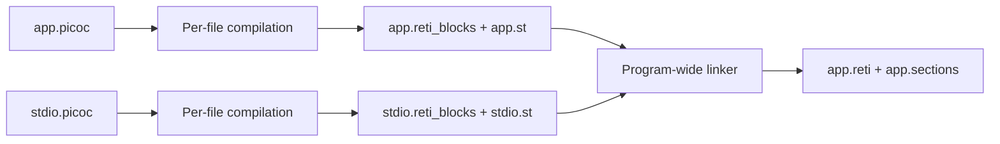
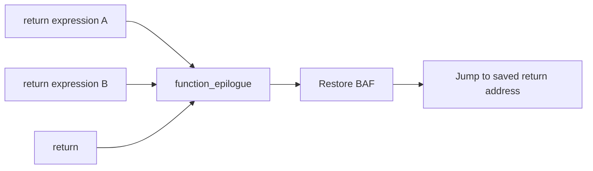
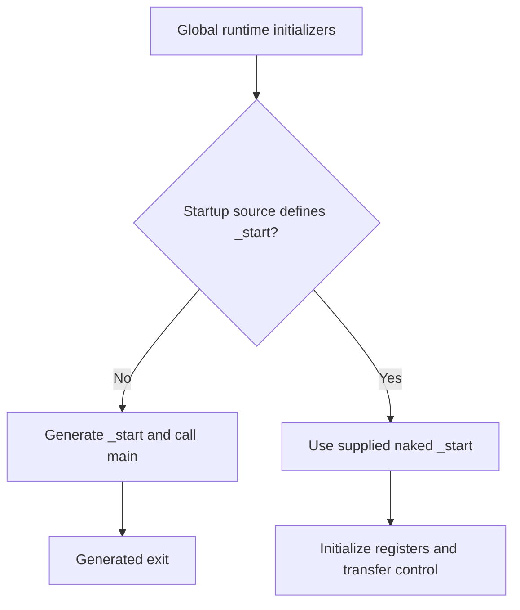

<p align="center">
</p>

<div align="center">
  <a href="https://github.com/matthejue/PicoC-Compiler">
    
  </a>
  <p align="center">
    Compiles the programming language <strong>PicoC</strong> (a subset of C) into the <strong>RETI</strong> assembler.
    <br />
    <br />
    <a href="https://youtu.be/Y9PtgwD9vg4">Colloquium Presentation Video</a>
    ·
    <a href="https://github.com/matthejue/Bachelorarbeit_Praesentation_out/blob/main/Main.pdf">Colloquium Presentation Slides</a>
    <br />
    <a href="./documentation/getting_started.md">Getting Started</a>
    ·
    <a href="https://github.com/matthejue/Bachelorarbeit_Dokumentation_out/blob/main/Dokumentation.pdf">Documentation</a>
    ·
    <a href="./documentation/references.md">References</a>
  </p>
</div>

[](https://asciinema.org/a/526542)

<!-- <a href="./documentation/abstract_syntax.txt">Abstract Syntax</a> -->
<!-- · -->
<!-- <a href="./documentation/help-page.txt">Usage</a> -->

## Installation and First Build

The one-step installation target creates `.virtualenv`, installs the Python
dependencies, adjusts the compiler entry point to use that environment, and
installs the global `picoc_compiler` symlink:

```bash
$ cd PicoC-Compiler
$ make full-install
```

`make full-install` may ask for administrator authentication while installing
the symlink in `/usr/local/bin`. Once installed, compile one or more PicoC
files directly:

```bash
$ picoc_compiler -O1 -o app.reti app.picoc
```

The default link produces `a.reti`; `-o` selects another output path. The
compiler accepts source files, separately compiled RETI-block artifacts, or a
mixture of both.

## Local Tree-sitter Parsers

The repository vendors the custom Tree-sitter grammars for RETI and PicoC in:

- `vendor/tree-sitter-reti`
- `vendor/tree-sitter-picoc`

To generate and build the parser libraries, change into each directory and run the Tree-sitter commands there.

For RETI:

```bash
$ cd /path/to/repo/vendor/tree-sitter-reti
$ tree-sitter generate
$ tree-sitter build -o reti.so
```

For PicoC:

```bash
$ cd /path/to/repo/vendor/tree-sitter-picoc
$ tree-sitter generate
$ tree-sitter build -o picoc.so
```

This produces the shared libraries expected by the local Neovim setup described below.

## Neovim Tree-sitter Setup

To get syntax highlighting for `.reti`, `.reti_blocks`, `.reti_patch`, `.picoc`, and `.header` files in Neovim, paste the following code into your `init.lua`:

```lua
local local_treesitter_filetypes = {}

local function register_local_parser(lang, parser_dir, query_names, extensions)
  local parser_path = vim.fs.joinpath(parser_dir, lang .. ".so")
  local filetype_extensions = {}

  for _, extension in ipairs(extensions or { lang }) do
    filetype_extensions[extension] = lang
  end

  vim.filetype.add({
    extension = filetype_extensions,
  })

  local_treesitter_filetypes[lang] = true
  vim.treesitter.language.register(lang, { lang })

  if vim.uv.fs_stat(parser_path) then
    local ok, err = vim.treesitter.language.add(lang, {
      path = parser_path,
    })
    if not ok then
      vim.notify("Failed to load " .. lang .. " treesitter parser: " .. err, vim.log.levels.WARN)
    end
  else
    vim.notify("Missing treesitter parser library: " .. parser_path, vim.log.levels.WARN)
  end

  for _, query_name in ipairs(query_names) do
    local query_file = vim.fs.joinpath(parser_dir, "queries", query_name .. ".scm")
    if vim.uv.fs_stat(query_file) then
      local lines = vim.fn.readfile(query_file)
      if #lines > 0 then
        vim.treesitter.query.set(lang, query_name, table.concat(lines, "\n"))
      end
    end
  end
end

register_local_parser(
  "picoc",
  "/path/to/repo/PicoC-Compiler/vendor/tree-sitter-picoc",
  { "highlights", "tags" },
  { "picoc", "header" }
)
register_local_parser(
  "reti",
  "/path/to/repo/PicoC-Compiler/vendor/tree-sitter-reti",
  { "highlights" },
  { "reti", "reti_blocks", "reti_patch" }
)

vim.api.nvim_create_autocmd("FileType", {
  group = vim.api.nvim_create_augroup("local-treesitter-parsers", { clear = true }),
  pattern = vim.tbl_keys(local_treesitter_filetypes),
  callback = function(event)
    local ok, err = pcall(vim.treesitter.start, event.buf, event.match)
    if not ok and not tostring(err):match("no parser for") then
      vim.notify("Failed to start treesitter for " .. event.match .. ": " .. err, vim.log.levels.WARN)
    end
  end,
})
```

This configuration:

- registers the local parser shared libraries
- maps `.picoc` and `.header` files to the `picoc` parser
- maps `.reti`, `.reti_blocks`, and `.reti_patch` files to the `reti` parser
- loads the vendored Tree-sitter query files for highlighting and tags

## Command-Line Options

The compiler command accepts one or more input files and produces linked RETI output by default.

Example:

```bash
$ ./run.py -s -O1 -o kernel.reti kernel/kernel.picoc
```

| Option | Argument | Description |
| --- | --- | --- |
| `FILE` | one or more paths | Input files. Supported units are `.picoc`, `.reti_blocks`, or matching `.st` metadata files. |
| `-h`, `--help` | none | Prints the command-line help. |
| `-i`, `--intermediate_stages` | none | Prints intermediate compiler stages to the terminal. This also builds files sequentially so diagnostic output stays ordered. |
| `-w`, `--write_files` | none | Writes intermediate stages to side files such as `.tokens`, `.ps`, `.st`, and `.reti_blocks` where applicable. |
| `-v`, `--verbose` | none | Adds comments and prints parsed CLI options. |
| `-vv`, `--double_verbose` | none | Shows wider parse trees and extra AST/type details. |
| `-t`, `--testmode` | none | Reads test metadata from `<input>.input` and `<input>.expected_output`. |
| `-T`, `--traceback` | none | Shows full Python tracebacks on errors. |
| `-d`, `--debug` | none | Enables debug mode and installs the post-mortem exception hook. |
| `-s`, `--supress_errors` | none | Skips the external C syntax check. The spelling is kept for compatibility. |
| `-b`, `--binary` | none | Enables binary output mode where supported. |
| `-m`, `--metadata_comments` | none | Copies top-of-file input, expected, and datasegment comments into the final `.reti` output. |
| `-I`, `--include` | `PATH` | Adds an include search path. This option can be used multiple times. |
| `-M`, `--max-depth` | `DEPTH` | Sets the maximum include depth. The default is `200`. |
| `-o`, `--output_name` | `OUTPUT` | Sets the linked RETI output path. With `-k`, this selects the path used for `memory_constants.header` instead of a `.reti` output path. The default is `a.reti`. |
| `-c`, `--compile` | none | Compiles source files without linking. This writes per-file `.reti_blocks` and `.st` outputs. |
| `--dependency-file` | path | With `-c` and one `.picoc` input, writes a Make dependency file for the source and every included file. |
| `--direct-source-link` | none | Compiles and links only the explicitly listed `.picoc` inputs without reading dependency metadata or reusing compiled artifacts. |
| `--show-input-files` | none | Prints the `.picoc` files or `.reti_blocks`/`.st` pairs used for the build. |
| `-C`, `--startup-source` | `PATH` | Links an additional PicoC startup source. If that file defines `_start`, its definition replaces the generated default and is placed first in `.text`; otherwise the default `_start` is generated. With `-C`, `Exit()` finishes with syscall `9` via `INT 4`. |
| `-g`, `--generate_debuginfo` | none | Writes `<output>.debuginfo` for linked `.picoc` inputs. |
| `-k`, `--kernelheader` | `sram` or `eprom` | Runs linking far enough to compute section addresses, then writes only `memory_constants.header`; in this mode `-o` selects the header path, not a `.reti` output path. `-k sram` generates SRAM-based kernel constants and `LOADI32` setup strings for `CS`, `DS`, `SP`, and `ACC`. `-k eprom` generates EPROM start-program constants with an SRAM maximum address, an EPROM data-segment setup string, and an SRAM-top stack setup string. |
| `--heap-size` | `CELLS` | Sets `heap_size` in linked memory metadata. Must be used together with `--stack-size`. |
| `--stack-size` | `CELLS` | Sets the number of cells between the end of the configured heap and `stack_start`. Must be used together with `--heap-size`. |
| `-O0` | none | Disables optimizations. This is the default optimization level. |
| `-O1` | none | Enables compile-time global initializer data generation. |

Previously compiled `.reti_blocks` and `.st` files are reused automatically
when a `.picoc` input, its included headers, and its compilation options have
not changed. Cache information is stored in the `.reti_blocks` file itself.
Requests using `-i` or `-w` compile the source again so the requested
intermediate output can be printed or written. Every cache hit prints the
reused `.reti_blocks` and `.st` pair.

### Separate Compilation and Dependency Tracking

`-c` compiles each PicoC unit once and stops before linking. The resulting
`.reti_blocks` file carries structured RETI plus cache/debug metadata, while
the matching `.st` file carries its symbol table:

```bash
$ picoc_compiler -c lib/stdio/stdio.picoc --dependency-file build/stdio.d
$ picoc_compiler app.picoc lib/stdio/stdio.reti_blocks -o app.reti
```



A primary source may declare additional link inputs in its leading comments:

```c
// dependencies: lib/stdio/stdio.reti_blocks drivers/uart.picoc
```

The metadata may follow blank lines or other leading comments. Dependency
paths may name `.picoc`, `.reti_blocks`, or matching `.st` files and are
resolved from the working directory or primary source directory.
`--direct-source-link` ignores both this metadata and cached artifacts.

With one `.picoc` input, `--dependency-file PATH` writes a Make dependency
file covering the source and every included header. To see whether a build
selected source or compiled artifacts, use:

```bash
$ picoc_compiler --show-input-files app.picoc lib/stdio/stdio.reti_blocks
```

Compiled artifacts are reused only when their recorded source, included-file
hashes, and relevant compiler options still match. A source/header change or a
different ABI, optimization, or debug setting recompiles the unit. `-i`, `-w`,
and `--direct-source-link` deliberately bypass reuse.

Staged artifacts preserve source/debug metadata, code-versus-data block kinds,
global declaration order, and `DS`-relative data references. Consequently a
link made only from `.reti_blocks`/`.st` pairs behaves like its direct-source
equivalent; `-C` may also select a compiled startup artifact.

The tests use staged compilation by default. Each `.picoc` file is
first compiled into `.reti_blocks` and `.st` files, which are then linked into
the final `.reti` file. Make validates every unique compilation unit once,
shares common dependencies such as `libstdio` between tests, and runs
independent compilation, linking, emulation, and host-C verification jobs in
parallel. When started from a terminal, the test runner asks whether it may
use all CPU cores or how many cores it should use. Non-interactive runs use
two jobs. `TEST_JOBS` skips the question and sets the parallelism directly:

```bash
$ make test TEST_JOBS=4
```

For maximum parallelism, use all available processors:

```bash
$ make test TEST_JOBS=$(nproc)
```

To run the tests with the earlier direct source-linking workflow instead, use:

```bash
$ make test TEST_BUILD_MODE=direct
```

The same option works with the saved failure list:

```bash
$ make test_not_passed TEST_BUILD_MODE=direct
```

## PicoC Language Support

PicoC intentionally implements a practical C subset for RETI programs. The
following features are especially useful to Pico-OS and separately compiled
libraries. The [Pico-OS feature notes](./documentation/new_features_for_pico_os.md)
provide the chronological history and OS-specific consequences in more detail.

| Feature | Supported behavior |
| --- | --- |
| Declarations | Local declarations may be mixed with statements and placed in nested blocks |
| Macros | Recursive object-like `#define` expansion; cycles stop safely; strings and character literals are not expanded internally |
| Constant expressions | Integer expressions are folded for array sizes and other compile-time uses |
| Types | Explicit casts, pointer return types, `void *`, `(void)` parameter lists, and scoped `typedef` names |
| Aggregate types | Global struct forward declarations, repeated compatible header declarations, arrays, and structs passed by value |
| Pointers | Datatype-scaled pointer arithmetic, dereference/member conditions, function pointers, and indirect calls |
| Arrays and strings | String literals, writable stack strings, and outer array sizes inferred from initializers |
| Expressions | `sizeof`, postfix `++` with its normal old-value result, and direct negation of function results |
| Functions | Trailing variadic `...` syntax and calls whose actual argument count controls stack allocation |
| Character escapes | `\0`, `\a`, `\b`, `\t`, `\n`, `\v`, `\f`, `\r`, quotes, backslash, and `\?` |

### Types, Allocation, and Pointer Arithmetic

Casts normally change the type used by later compiler decisions rather than
emitting a separate conversion instruction. The pointed-to type still controls
the scale used for pointer arithmetic:

```c
#define NULL ((void *)0)

struct Header;

struct Header {
    int size;
    struct Header *next;
};

void *kmalloc(int cells);

struct Header *allocate_header(void) {
    struct Header *header = (struct Header *)kmalloc(sizeof(struct Header));
    int *payload = (int *)(header + 1);
    header->next = (struct Header *)(payload + header->size);
    return header;
}
```

Forward declarations must be global. Compatible struct definitions, struct
attributes, and function declarations may safely recur through headers used by
several compilation units.

### Arrays, Strings, and Expressions

An omitted outer array size is inferred from a valid initializer. Local
character arrays hold writable stack data, whereas a pointer to a string
literal refers to a null-terminated compiler-generated global:

```c
#define ROWS 3
#define COLS 5

int cells[ROWS * COLS];
int device_ready(void);

int process(char *pointer) {
    char message[] = "ready\n";
    int values[] = {10, 20, 30};
    int index = 0;

    if (*pointer && values[index++]) {
        return sizeof(message);
    }
    return !device_ready();
}
```

String escapes are decoded before array sizing, so `message` above includes
one newline cell and one terminating null cell. Identical literals within one
compilation unit share a generated global; literals from different units get
collision-free linker names.

### Function Pointers and Variadic Functions

Function pointers can be declared, stored in arrays, passed through typedefs,
and called indirectly. Parameter names are omitted inside the pointer type:

```c
typedef int (*operation_t)(int, int);

int add(int left, int right);
int sub(int left, int right);
int printf(char *format, ...);

operation_t operations[] = {add, sub};

int calculate(int selected) {
    int result = operations[selected](7, 4);
    printf("result: %d\n", result);
    return result;
}
```

Calls evaluate and push arguments from right to left. Variadic functions access
the extra cells through the same stack-frame layout described below; Pico-OS
`printf(format, ...)` starts its extra arguments at `BAF + 4` and
`fprintf(stream, format, ...)` at `BAF + 5`.

## PicoC Attributes and Entry Points

PicoC supports a small subset of GNU-style attributes for low-level RETI programs:

- `__attribute__((section("ivt")))` may be placed before a global variable declaration, function declaration, or function definition. For functions, either the declaration or the definition is enough to place the generated blocks in `.ivt`. The attribute string omits the dot, but the generated output section is `.ivt`; other section names are rejected. This is intended for interrupt vector tables and interrupt service routines. With `-O1`, compile-time global data with this attribute is emitted into `.ivt` instead of `.data`; references to globals in this section use `CS` as their base register, while ordinary globals still use `DS`.
- `__attribute__((naked))` may be placed before a function definition. Naked functions do not get the compiler-generated stack-frame prologue or shared `<function>_epilogue` block. `return;` emits no epilogue jump, and `return expr;` only evaluates the expression and places the result in `IN2`, so the function must provide its own low-level return/control-flow sequence.
- Non-naked functions get one shared `<function>_epilogue` block directly after the function's other blocks. `return expr;` stores the return value in `IN2` and jumps to that epilogue; call continuations read non-void return values from `IN2`.
- If the startup source does not define `_start` and no global `main` exists, the compiler prints a warning and does not generate `_start`. The output can still be produced, but it is not directly executable through the usual entry path.

Example:

```c
int keypress_interrupt(void);

__attribute__((section("ivt")))
int (*ivt[])(void) = {
    keypress_interrupt
};

__attribute__((section("ivt")))
__attribute__((naked))
int keypress_interrupt(void) {
    /* low-level interrupt return sequence */
}
```

### Inline RETI Assembly and Debug Traps

`asm("...");` accepts one string containing one or more RETI instructions. The
contents are parsed into the normal RETI AST, so symbolic operands are resolved
after every compilation unit and section has been laid out:

```c
void transfer_to_kernel(void) {
    debug; /* Lowers to INT 3 */
    asm("LOADI32 ACC start_loaded_kernel");
    asm("ADD ACC CS");
    asm("MOVE ACC PC");
}
```

`debug;` is an explicit emulator/debugger trap rather than a logging call.
Structured RETI and inline assembly also support `NOP` and these
pseudoinstructions:

| Pseudoinstruction | Purpose | Expansion timing |
| --- | --- | --- |
| `LOADI32 reg operand` | Loads a 32-bit immediate or resolved symbol | After symbolic addresses are known |
| `JUMP32 rel target` | Reaches a target beyond a normal jump offset | After final block positions are known |
| `PUSH reg` | Runs `SUBI SP 1`, then `STOREIN SP reg 1` | During RETI patching |
| `POP reg` | Runs `LOADIN SP reg 1`, then `ADDI SP 1` | During RETI patching |

The push updates `SP` before storing and the pop reads before updating `SP`.
This order prevents an interrupt between the two instructions from overwriting
a live stack cell.

### `static inline` Assembly Helpers

The supported inlining form is a no-argument `static inline` function whose
body contains only assembly statements:

```c
static inline void save_acc(void) {
    asm("PUSH ACC");
}
```

A statement-form `save_acc();` call is replaced by those assembly statements,
and no separate function is emitted. Parameters, call arguments, and ordinary
C bodies are not supported by this inlining form.

## Runtime ABI and Startup

Calls push arguments from right to left. The caller reserves space based on
the actual arguments and releases it after the callee returns; the callee saves
and restores `BAF`. From higher to lower addresses, a typical two-argument
frame is:

| Address relative to `BAF` | Contents | Owner |
| --- | --- | --- |
| `BAF + 4` | Second argument or first variadic argument | Caller |
| `BAF + 3` | First argument | Caller |
| `BAF + 2` | Return address | Caller |
| `BAF + 1` | Saved previous `BAF` | Callee |
| `BAF` | First local variable | Callee |
| `BAF - 1` | Later local variable | Callee |
| `SP` | Free cell below the occupied frame | Stack boundary |

Multi-cell arrays and structs occupy their full width in this direction. A
struct passed by value uses its base cell as its logical address, keeping
member access and forwarding consistent.

Every ordinary function has one `<function>_epilogue` block. All source
returns converge there; a non-void result is kept in `IN2`, leaving `ACC`
available to expand a long jump:



When no custom startup is selected, the compiler collects global runtime
initializers, generates `_start`, calls a global `main`, and emits the normal
exit sequence. `main` is compiled as an ordinary stack-framed function rather
than receiving special global-style storage. If no `main` exists, linking
continues with a warning and no generated `_start`, which is useful for
libraries and loader-managed units.

`-C PATH` links an additional PicoC or compiled RETI-block startup unit. If it
defines `_start`, that function replaces the default and is placed first in
`.text`; otherwise the compiler still generates the normal entry point. Global
initializers precede either form, and `Exit()` uses syscall 9 through `INT 4`
while `-C` is active.

For example, a naked EPROM startup can initialize the register bases and jump
to OS code without a compiler-generated frame:

```c
__attribute__((naked))
void _start(void) {
    asm(EPROM_STACK_START_ASM);
    asm("MOVE SP BAF");
    asm(EPROM_DS_START_ASM);
    asm("ADD DS CS");
    asm("LOADI32 ACC boot_main");
    asm("ADD ACC CS");
    asm("MOVE ACC PC");
}
```



## Linked Images, Debug Information, and Memory Metadata

Linked output separates interrupt vectors, instructions, and global data. The
linker writes a matching `.sections` file so the emulator, loader, and header
generator can interpret those addresses correctly.

| Start address | Region | Addressing and purpose |
| --- | --- | --- |
| `0` | `.ivt` | Hardware-readable interrupt vector cells |
| `codesegment_start` | `.text` | `PC`/`CS`-relative instructions |
| `datasegment_start` | `.data` | `DS`-relative global storage |
| `heap_start` | Free memory | First cell after all static global storage |

RETI-block IVT entries may be numeric or name a handler directly. A numeric
`IVTE i` becomes `2^31 + i`; `IVTE timer_interrupt` becomes `2^31` plus the
resolved section-relative handler address. With `-O1`, compile-time-known
scalar, aggregate, string, and function addresses are emitted directly into
ordered `.data` or `.ivt` blocks. Under `-O0`, the default, `_start` performs
the stores. Runtime-dependent globals remain startup work at either level.

### Debug and Intermediate Artifacts

`-g` writes `<output>.debuginfo` with source ranges, global addresses,
`BAF`-relative locals and arguments, call sites, return addresses, and frame
information. Debug locations refer to the generated `.pre` source, so use
`-i -w` when source-correlated emulator debugging is needed:

```bash
$ picoc_compiler -O1 -g -i -w -o kernel.reti kernel.picoc
$ less kernel_startprogram.reti_blocks
$ less kernel_combined.reti_blocks
```

The first RETI-block file exposes generated startup code; the second exposes
the merged program before block flattening. With `-i -vv`, intermediate ASTs
include source file and line information. Generated labels include their owner,
such as `schedule_while_branch.9`, and `-m` preserves supported leading
metadata comments in final RETI output.

### Loader Metadata and Kernel Headers

A `.sections` file records values such as:

```json
{
  "interrupt_service_routines_start": 4,
  "codesegment_start": 4,
  "datasegment_start": 32705,
  "heap_start": 33189,
  "heap_size": -1,
  "stack_start": 40000
}
```

| Memory area | Boundary or direction |
| --- | --- |
| Static data | Ends at `heap_start - 1` |
| Kernel heap | `heap_start` through `heap_start + heap_size - 1` |
| Kernel stack | Grows downward from `stack_start` |
| Process memory | Begins at `stack_start + 1` |

`-1` lets the loader or header generator apply its configured default.
`interrupt_service_routines_start` appears when handler code follows a leading
numeric IVT. It tells the loader where that code begins.
`-k sram` and `-k eprom` link far enough to calculate this layout and then
write only `memory_constants.header`; in this mode `-o` selects the header
path. SRAM headers provide tagged memory-map constants and `LOADI32` strings
for `CS`, `DS`, `SP`, and `ACC`; an unspecified heap size becomes `4096` cells.
EPROM headers provide the SRAM maximum and the assembly strings needed for
EPROM data-segment and SRAM stack setup.

```bash
$ picoc_compiler -O1 -k sram -o build/memory_constants.header kernel.picoc
```

## Compiler Pipeline Overview

This section summarizes how the compiler processes PicoC source files, covering preprocessing, lexing, parsing, AST passes, and final RETI output.

The relevant implementation lives mainly in:

- [`source/preprocessor.py`](/home/areo/Documents/Studium/PicoC-Compiler/source/preprocessor.py)
- [`source/option_handler.py`](/home/areo/Documents/Studium/PicoC-Compiler/source/option_handler.py)
- [`source/passes/`](/home/areo/Documents/Studium/PicoC-Compiler/source/passes/)
- [`source/ast_transformers.py`](/home/areo/Documents/Studium/PicoC-Compiler/source/ast_transformers.py)

### Overall Flow

For PicoC input files, the high-level pipeline is:

```mermaid
flowchart LR
    source[PicoC source]

    subgraph preprocessing[Preprocessing]
        preprocessor[Includes, macros, and line splicing]
        preprocessed[Preprocessed source]
    end

    subgraph frontend[Lexing and parsing]
        tokens[Token stream]
        parse_tree[Tree-sitter parse tree]
        ast[PicoC AST]
    end

    subgraph compilation[Per-file compilation passes]
        shrink[picoc_shrink]
        blocks[picoc_blocks]
        symbol[picoc_symbol]
        typing[picoc_typing]
        anf[picoc_anf]
        reti_blocks[reti_blocks]
    end

    subgraph linking[Program-wide linking passes]
        merge[Merge units, symbols, and startup]
        patch[reti_patch]
        reti[reti]
    end

    output[Flat RETI output]

    source --> preprocessor --> preprocessed --> tokens --> parse_tree --> ast
    ast --> shrink --> blocks --> symbol --> typing --> anf --> reti_blocks
    reti_blocks --> merge --> patch --> reti --> output
```



| Stage | Scope | Main output |
| --- | --- | --- |
| Preprocessing | Per source file | Expanded PicoC source and include dependencies |
| Lexing and parsing | Per source file | Tokens, parse tree, and PicoC AST |
| PicoC lowering | Per source file | Typed, block-based RETI intermediate representation |
| Linking | Whole program | Merged symbols, sections, and resolved labels |
| RETI lowering | Whole program | Flat `.reti` instruction stream |

Example:

- Input files: `main.picoc`, `util.picoc`
- Each file is preprocessed and compiled separately up to `reti_blocks`
- After that, the per-file results are merged
- Then the combined RETI program is patched and flattened into final RETI instructions

### Preprocessing

The preprocessing stage is implemented in [`source/preprocessor.py`](/home/areo/Documents/Studium/PicoC-Compiler/source/preprocessor.py) and is called from [`source/option_handler.py`](/home/areo/Documents/Studium/PicoC-Compiler/source/option_handler.py).

#### What It Supports

The preprocessor is intentionally small. It supports:

- `#include "file.header"`
  Example: `#include "defs.header"`
- `#include <file.header>`
  Example: `#include <stdio.header>`
- `#pragma once`
  Example: a header with `#pragma once` is only included the first time
- simple object-like `#define`
  Example: `#define N 8`

It does not implement full C preprocessing with function-like macros or conditional compilation.

#### Include Resolution

Include resolution depends on whether the include is quoted or angled.

| Include form | Search order |
| --- | --- |
| `#include "defs.header"` | Including file's directory, then `-I` paths, then system include paths |
| `#include <defs.header>` | `-I` paths, then system include paths |
| `#include "/tmp/defs.header"` | Use the absolute path directly |

#### `#pragma once`

If a file contains `#pragma once`, its canonical path is recorded and future includes of that same file are skipped.

Example:

- `a.picoc` includes `defs.header`
- `b.picoc` also includes `defs.header`
- if `defs.header` contains `#pragma once`, the second inclusion produces no output for that file within the same preprocessing run

#### Macros

The preprocessor stores simple object-like macros and substitutes them later when identifiers are encountered in normal code.

Examples:

- `#define N 8` then `int a[N];` becomes effectively `int a[8];`
- `#define A B` and `#define B 4` allows recursive expansion so `A` becomes `4`

String literals and character literals are not macro-expanded internally.

Example:

- `#define X 7`
- `"X"` stays `"X"`
- `X` in normal code becomes `7`

#### Comments and Line Splicing

The preprocessor distinguishes normal code from comments, strings, and char literals so directives are only recognized where they should be.

Examples:

- `// #include "x.header"` is ignored as a comment, not treated as a directive
- `/* #define A 1 */` is ignored as a block comment
- `" #include <x> "` inside a string is preserved as string content
- a backslash followed by newline joins physical lines into one logical line

### Per-File Compilation in `option_handler.py`

The entry point is [`OptionHandler.build_all`](/home/areo/Documents/Studium/PicoC-Compiler/source/option_handler.py#L31), which reads the CLI input files and compiles them.

#### Building Multiple Files

`build_all()` takes all input files from `global_vars.args.infiles`.

Main behavior:

- It syntax-checks the list of input files first with `_syntax_check(...)`.
- `_syntax_check(...)` invokes an external C compiler, preferring `clang` and otherwise `gcc`, with `-x c -fsyntax-only -Wall -Wextra -Wpedantic -std=c11`.
  Example: syntax errors are reported by `clang`/`gcc`.
- If `intermediate_stages` is enabled, files are built sequentially.
  Example: this keeps diagnostic output ordered and readable.
- Otherwise, files are built in parallel with `ThreadPoolExecutor`.
  Example: `a.picoc`, `b.picoc`, and `c.picoc` can be compiled independently at the same time.

Each file is compiled by `build_file(path)`.

#### What Happens for One PicoC File

For a `.picoc` file, `build_file()` does:

1. set the current file-based output stem
   Example: `main.picoc` sets `path_without_ext` to `main`
2. preprocess the file with `_preprocess(path)`
   Example: includes are expanded
3. lex and parse the preprocessed code in `_compl(code)`
4. build the AST
5. run the PicoC-to-RETI-block passes
   Example: the AST is lowered step by step until `reti_blocks`

The result returned for each file is:

- one `reti_blocks` AST
- one symbol table
- one dictionary of all generated blocks

### Lexing, Tokens, and Parse Tree Generation

`_compl(code)` in [`source/option_handler.py`](/home/areo/Documents/Studium/PicoC-Compiler/source/option_handler.py) runs the parser frontend and then the lowering pipeline.

#### Lexing / Token Generation

The frontend tokenizes the preprocessed source.

Main points:

- The frontend is implemented in [`source/ast_transformers.py`](/home/areo/Documents/Studium/PicoC-Compiler/source/ast_transformers.py), mainly by `TransformerPicoC`.
- `TransformerPicoC` uses the vendored PicoC grammar from `vendor/tree-sitter-picoc/picoc.so` through the `tree_sitter` Python bindings.
- `TransformerPicoC.parse_tree(code)` performs the actual Tree-sitter parse.
- `OptionHandler._tokens_option(...)` extracts the leaf tokens from the Tree-sitter parse result.
- When token output is enabled, those tokens can be printed or written to a `.tokens` file.

#### Parse Tree Generation

The frontend also produces a parse tree.

Main points:

- The parse tree is generated by Tree-sitter via `TransformerPicoC.parse_tree(code)`.
- `_parse_tree_pass(...)` formats that parse tree for diagnostic output or file output.
- The parse tree is an intermediate representation between source text and AST.

#### AST Construction

The parse tree is converted into the compiler's PicoC AST.

Main points:

- `transformer.build_ast(ts_tree, code)` in [`source/ast_transformers.py`](/home/areo/Documents/Studium/PicoC-Compiler/source/ast_transformers.py) walks the Tree-sitter parse tree and builds the compiler's PicoC AST.
- The AST construction logic therefore lives in `ast_transformers.py`, while the later lowering logic lives in `source/passes/`.

### Symbol Table Output and `.st` Files

`OptionHandler._st_pass(...)` serializes symbol tables with `symbol_table.to_json_str(pretty=True)`.

Main points:

- The per-file symbol table after `picoc_symbol` can be printed as JSON.
- `-i` / `--intermediate_stages` prints the JSON symbol table to the terminal.
- `-w` / `--write_files` writes the JSON symbol table to `<path_without_ext>.st`.
- `-c` / `--compile` also causes the per-file symbol table JSON to be written to `<path_without_ext>.st`.
- During linking / multi-file handling, the merged symbol table is also emitted in the same JSON form.
- These `.st` files contain JSON symbol table state relevant to that stage, including scopes and symbol metadata such as datatype, address, and size where available.

### The Main AST/Lowering Passes

The pass pipeline is defined in [`source/passes/`](/home/areo/Documents/Studium/PicoC-Compiler/source/passes/) and run from [`source/option_handler.py`](/home/areo/Documents/Studium/PicoC-Compiler/source/option_handler.py).

#### `picoc_shrink`

This pass reduces richer PicoC syntax to a smaller core language.

Main tasks:

- Rewrites array access `arr[i]` into pointer arithmetic plus dereference.
  Example: `arr[i] -> *(arr + i)`.
- Performs small constant folding for arithmetic and comparisons.
  Example: `2 + 3 -> 5`, `4 < 7 -> 1`.
- Simplifies pointer cancellation patterns.
  Example: `*&x -> x`, `&*p -> p`.
- Applies these rewrites recursively to expressions, statements, declarations, and definitions.
  Example: a folded expression inside `return 2 + 3;` becomes `return 5;`.

#### `picoc_blocks`

This pass removes structured control flow and replaces it with explicit block-level control flow.

Main tasks:

- Replaces `if`, `if/else`, `while`, and `do/while` with combinations of `Block`, `GoTo`, and simpler `IfElse`.
  Example: `while (x) { body }` becomes a condition block, a body block, and an after block.
- Creates separate labeled blocks for branch bodies, loop bodies, condition checks, and fallthrough code.
  Example: names like `if.3`, `else.4`, `condition_check.5`.
- Stores all generated blocks in `self.all_blocks` for later jump resolution.
  Example: later passes can resolve `GoTo(Name("if.3"))`.

Function handling:

- Each function gets one entry block whose label is exactly the function name.
  Example: the entry block for `main` is labeled `main`, not `main.7`.
- Only compiler-generated helper blocks receive numeric suffixes.
  Example: inside `main`, additional blocks may be named `if.3`, `while_branch.4`, or `if_else_after.5`.
- The function entry block is created with `add_id=False`, while helper blocks use the default numbered form.
  Example: `foo` is the function entry label, but a generated branch target becomes something like `if.8`.
- Function-call continuation blocks use the normalized source block family plus `_cont.<id>`.
  Example: a call inside `if.4` continues at `if_cont.6`, and a later call in that continuation becomes `if_cont.7`, not `if.4_cont.6_cont.7`.

#### `picoc_symbol`

This pass builds the symbol table and rewrites names into concrete storage references.

Main tasks:

- Declares globals, locals, parameters, functions, and structs in the symbol table.
  Example: `int x;` becomes a symbol entry for `x` with datatype and scope.
- Computes datatype sizes and stack offsets.
  Example: a local `int x` may get a stackframe offset such as `StackframeLocalVar(0)`.
- Rewrites `Name(x)` into `Global(x)`, `StackframeLocalVar(offset)`, or `StackframeParam(offset)`.
  Example: a global use of `x` becomes `Global(Name("x"))`.
- Replaces `const` values with compile-time values where possible.
  Example: `const int n = 4;` can later be used as `4`.
- Creates a `_global_inits` block for global initialization code.
  Example: top-level initializers are collected into one synthetic block.
- Inserts function-entry information such as local stack allocation requirements.
  Example: a function with three local words gets `NewStackframe(3)` at entry.

#### `picoc_typing`

This pass annotates the PicoC AST with datatype information.

Main tasks:

- Determines expression result types.
  Example: `1 + 2` gets type `IntType`.
- Handles pointer dereference and reference types.
  Example: if `p` has type `int*`, then `*p` gets type `int` and `&x` gets type `int*`.
- Resolves struct attribute types and array element types.
  Example: `point.x` gets the datatype declared for field `x`.
- Annotates function calls with their return type.
  Example: a declared `printf(...)` call gets the return type from its declaration.
- Stores the inferred datatype information directly on AST nodes.
  Example: a `BinOp` node receives a `.datatype` field.

#### `picoc_anf`

This pass transforms the typed PicoC AST into A-normal form and a stack-oriented intermediate representation.

Main tasks:

- Makes evaluation order explicit.
  Example: `f(g(x), h(y))` becomes a sequence where `g(x)` and `h(y)` are evaluated in order.
- Breaks complex expressions into small steps with intermediate results on the stack.
  Example: `a + b * c` becomes separate stack operations for `b * c` and then the addition.
- Lowers function calls into explicit stack-frame setup, jump, and return-value handling.
  Example: a call saves a labeled return address, evaluates the callee address, jumps with `GoTo(Stack(1))`, and continues in a generated continuation block.
- Lowers assignments, dereferences, struct access, conditions, and returns into simple stack-based operations.
  Example: `return x + 1;` becomes evaluate `x`, evaluate `1`, add, move the result to `IN2`, and jump to the function's shared `<function>_epilogue` block.

#### Function Calls and Stack Frames

The runtime stack frame is arranged from lower to higher addresses as:

1. local variables
2. saved frame pointer, the previous `BAF`
3. return address
4. arguments

The called function saves and restores the frame pointer (`BAF`). This keeps both ordinary function calls and interrupt service routines stack based: an `INT i` places the return address on the stack, while a function entry places the previous `BAF` on the stack. The address to continue after a function call is represented by a generated continuation block label such as `<block_base>_cont.<idx>`. The call site saves that address with `LOADI32 ACC <block_base>_cont.<idx>`, adds `CS` to make it absolute, and pushes `ACC` onto the stack.

#### `reti_blocks`

This pass lowers PicoC A-normal-form blocks into RETI instruction blocks.

Main tasks:

- Replaces each PicoC stack-based intermediate operation with the concrete RETI instruction sequence that performs the same work on registers and memory.
  Example: `Exp(BinOp(Stack(2), Add(), Stack(1)))` means "take the top two stack values, add them, and leave the result on the stack". It is lowered to RETI steps that load the two operands from stack memory into registers, execute `ADD`, store the result back to the stack, and then adjust the stack pointer.
- Emits RETI instructions for arithmetic, logic, comparisons, loads, stores, stack operations, calls, returns, and jumps.
  Example: a return becomes instructions that restore state and jump via the saved return address.
- Handles special cases such as pointer arithmetic, dereference, `sizeof`, and boolean conversion.
  Example: pointer addition scales the index by element size before adding.

### Linking / Multi-File Handling

Each source file is compiled separately up to `reti_blocks`. The combination of multiple compilation units is the linking stage in this project, and that linker logic lives in [`source/option_handler.py`](/home/areo/Documents/Studium/PicoC-Compiler/source/option_handler.py).

#### Per-File Result Collection

After all files are built, `build_all()` collects:

- `asts`
- `symbol_tables`
- `all_file_blocks`

Example:

- `main.picoc` contributes one RETI-block AST and one symbol table
- `util.picoc` contributes another RETI-block AST and symbol table
- both are stored until the linking / multi-file handling stage

#### Inserting `_start`

Before final linking / multi-file handling, `_insert_start_fun()` selects or creates the start block.

Main tasks:

- Collects every `_global_inits` block from the per-file ASTs and removes those blocks from their original files.
  Example: global initializations from `a.picoc` and `b.picoc` are moved into the start sequence.
- Uses `_start` from the PicoC file supplied through `-C` when that file defines it, and moves its entry block to the beginning of `.text`.
- Otherwise, searches the merged symbol tables for a global `main` and builds the default `_start` block that calls `main()` and then exits.
  Example: if no `main` exists and the startup source does not define `_start`, compilation continues with a warning and no `_start` block is generated.
- Lowers a generated start file through `reti_blocks`; a provided `_start` has already passed through normal compilation.
- Prepends the collected global initializers to the selected `_start`.
  Example: static initialization code executes before either the provided startup body or the default call to `main`.

#### Merging ASTs and Symbol Tables

After `_start` is inserted, `_link()` merges everything as part of the linking / multi-file handling stage.

Main tasks:

- `_merge_asts()` concatenates all per-file RETI blocks into one file AST.
  Example: blocks from `_start`, `main.picoc`, and `util.picoc` are placed into one combined file node.
- `_merge_symbol_tables()` merges scopes from all files into one symbol table.
  Example: global symbols from all files are inserted into one shared `global` scope.
- Global addresses are reassigned sequentially during symbol-table merge.
  Example: if global `x` has size 1 and global `arr` has size 4, they may receive addresses `0` and `1`.
- All block dictionaries are merged so label resolution works across files.
  Example: a jump to a block defined in another compilation unit can still be resolved after merging.

#### When Symbolic Names Become Concrete Addresses

Part of linking / multi-file handling is preparing one merged symbol table with final global addresses, but the actual replacement of symbolic names inside RETI instructions happens later in the final [`reti`](/home/areo/Documents/Studium/PicoC-Compiler/source/passes/linking/reti_pass.py) pass.

Relevant place in the code:

- [`Passes._reti_instr()`](/home/areo/Documents/Studium/PicoC-Compiler/source/passes/linking/reti_pass.py) resolves symbolic RETI operands with `self.symbol_table.resolve(...)`
  Example: `Instr(Loadin(), [Ds, Acc, Name("x")])` becomes `Instr(Loadin(), [Ds, Acc, Im(addr_of_x)])`.
- The same method also handles offsets built on top of symbolic names.
  Example: `BinOp(Name("arr"), Add(), 3)` becomes `Im(addr_of_arr + 3)`.
- It also resolves symbolic immediates loaded directly with `Loadi`.
  Example: `Loadi(Acc, Name("x"))` becomes `Loadi(Acc, Im(addr_of_x))`.

Important distinction:

- Stackframe-local accesses do not need this final name replacement.
  Example: a local variable use was already rewritten much earlier from `Name("x")` to something like `StackframeLocalVar(Num("0"))` in `picoc_symbol`.
- In other words, locals and parameters are resolved to stack-frame offsets before the RETI stage.
  Example: a local `x` becomes an access relative to `Baf`, not a symbolic RETI name.
- The final `reti` pass mainly has to replace symbolic names that still refer to globally addressed entities.
  Example: global variables used through `Ds` addressing still carry names until `reti` converts them to numeric addresses.

Reason for the distinction:

- Local function variables and parameters live inside one function's stack frame, so their position can already be determined during `picoc_symbol`.
  Example: once the local layout of a function is known, `x` can be fixed as something like `StackframeLocalVar(Num("0"))`.
- Global variables live in one shared program-wide address space, so their final concrete addresses depend on the merged symbol tables of all input files.
  Example: the final address of global `x` depends on how many other globals from other files are placed before it.
- Because of that, locals are resolved early by function-local stack layout, while globals are resolved later by linking / multi-file handling.

### Final RETI-Side Passes

After all files are merged, two final passes run on the combined RETI-block AST.

#### RETI Pseudoinstructions

Some RETI-side nodes are pseudoinstructions that are expanded after higher-level lowering.

- `PUSH reg` reserves a stack slot with `SUBI SP 1` and then stores `reg` with `STOREIN SP reg 1`.
- `POP reg` loads the top stack value with `LOADIN SP reg 1` and then releases the slot with `ADDI SP 1`.
- `LOADI32 reg operand` loads a 32-bit immediate or symbolic address into `reg`.
  Example: function calls use it to load a continuation block label before pushing the return address.
- `JUMP32 rel target` jumps to a 32-bit immediate or symbolic block target.
  Example: block-level control flow uses it when the final jump distance is not known yet.

Pseudoinstructions are split between the final RETI-side passes by whether they depend on block labels:

- `reti_patch` expands pseudoinstructions that do not depend on block-label addresses.
  Example: `PUSH` and `POP` can be replaced directly by their concrete machine-instruction sequences, which may increase block sizes in a straightforward way.
  Their instruction order keeps the stack pointer in a protective position even if a hardware interrupt occurs between the two generated instructions. `PUSH` moves `SP` before writing the value, so an interrupt cannot overwrite the not-yet-written stack slot. `POP` reads the value before moving `SP` back, so an interrupt cannot overwrite the still-needed stack slot before it is read.
- `reti` expands pseudoinstructions that depend on symbolic block labels or final instruction positions.
  Example: `LOADI32` and `JUMP32` are lowered only after label addresses and jump targets are known.

#### `reti_patch`

This pass adjusts RETI instruction blocks to satisfy machine-level constraints.

Main tasks:

- Expands instructions that use immediates too large for the target format.
  Example: one large `LOADI` may become several instructions that build the constant in a register.
- Inserts explicit division-by-zero checks.
  Example: before `DIV`, the divisor is checked and execution aborts on zero.
- Removes useless jumps to the immediately following block.
  Example: a final `jump next_block` is dropped if control would fall through anyway.
- Converts block-sensitive pseudo instructions into concrete machine-instruction
  sequences while block sizes are still known.
  Example: `PUSH ACC` becomes `SUBI SP 1` followed by `STOREIN SP ACC 1`.
- Counts instructions per block and records block start positions for later jump-distance computation.
  Example: block `foo` may get metadata like "starts at instruction 27".

#### `reti`

This is the final lowering pass. It removes block structure, resolves symbolic
references, and expands pseudo instructions that do not need block-level
metadata.

Main tasks:

- Flattens all RETI blocks into one final instruction stream.
  Example: separate blocks `_start`, `main`, `if.1`, and `after.2` become one ordered RETI program.
- Replaces block-label jumps with relative jump distances or long-jump sequences.
  Example: `Jump(..., Name("if.1"))` becomes `Jump(..., Im("12"))`.
- Replaces symbolic variable names with concrete addresses from the symbol table.
  Example: a global `x` is replaced by its final data-segment address.
- Converts remaining non-block pseudo instructions into concrete
  machine-instruction sequences.
  Example: `LOADI32` is expanded after symbolic addresses are known.
