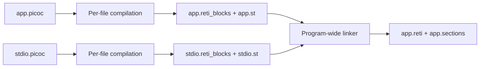
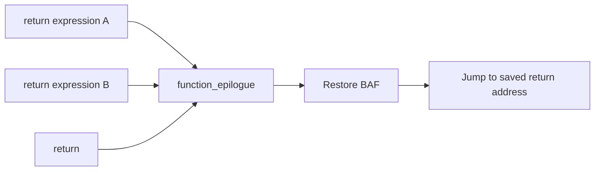
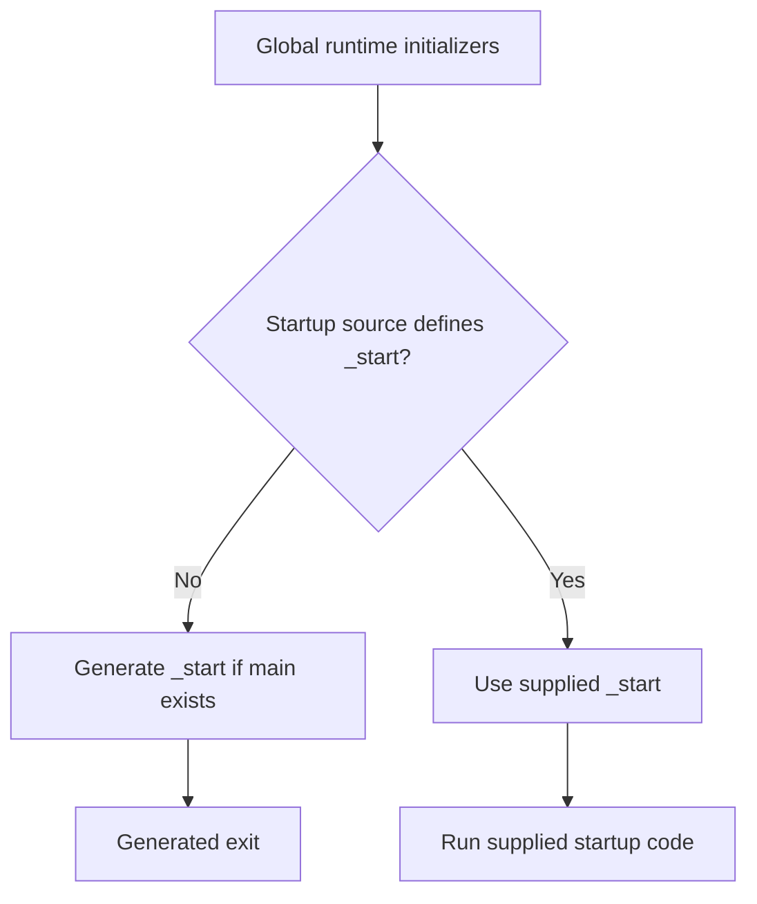

<div align="center">
  <p align="center">
    Compiles the programming language <strong>PicoC</strong> (a subset of C) into <strong>RETI</strong> assembly.
    <br />
    <br />
    <a href="https://youtu.be/Y9PtgwD9vg4">Colloquium Presentation Video</a>
    ·
    <a href="https://github.com/matthejue/Bachelorarbeit_Praesentation_out/blob/main/Main.pdf">Colloquium Presentation Slides</a>
    <br />
    <a href="#installation-and-first-build">Getting Started</a>
    ·
    <a href="https://github.com/matthejue/Bachelorarbeit_Dokumentation_out/blob/main/Dokumentation.pdf">Documentation</a>
    ·
    <a href="#compiler-pipeline-overview">Compiler Internals</a>
  </p>
</div>

PicoC targets RETI, the teaching CPU used by [PicoOS](../Pico-OS/README.md).
The recording shows a compilation session:

[](https://asciinema.org/a/526542)

## Installation and First Build

The compiler needs its Python dependencies and the two vendored Tree-sitter
libraries. Set up the environment and build those libraries from the repository:

```bash
$ cd PicoC-Compiler
$ python3 -m venv .virtualenv
$ .virtualenv/bin/python -m pip install -r requirements-dev.txt
$ .virtualenv/bin/python scripts/build_tree_sitter.py
```

[`run.py`](run.py) automatically uses [`.virtualenv`](.virtualenv). To make it available as
`picoc_compiler`, create the same system-wide symlink used by the installer:

```bash
$ sudo ln -s "$(pwd)/run.py" /usr/local/bin/picoc_compiler
```

You can then compile a source file such as `app.picoc`:

```bash
$ picoc_compiler -O1 -o app.reti app.picoc
```

Without `-o`, linking writes `a.reti`. Inputs may be PicoC source, compiled
`.reti_blocks`/`.st` pairs, or both. Use [`./run.py`](./run.py) instead of
`picoc_compiler` if you do not install the symlink.

## Local Tree-sitter Parsers

The compiler uses the grammars in [`vendor/tree-sitter-reti`](vendor/tree-sitter-reti/)
and [`vendor/tree-sitter-picoc`](vendor/tree-sitter-picoc/).
[`scripts/build_tree_sitter.py`](scripts/build_tree_sitter.py) builds their checked-in parser sources.
After changing a grammar, regenerate it with the Tree-sitter CLI first.
For RETI:

```bash
$ cd /path/to/repo/vendor/tree-sitter-reti
$ tree-sitter generate
$ tree-sitter build -o reti.so
```

For PicoC, use the same steps in its grammar directory:

```bash
$ cd /path/to/repo/vendor/tree-sitter-picoc
$ tree-sitter generate
$ tree-sitter build -o picoc.so
```

These `.so` libraries also work with the Neovim configuration below. The build
script uses `.dylib` on macOS and `.dll` on Windows. The compiler's
[`_load_ts_language()`](source/ast_transformers.py#L23) loads the library for the current platform.

## Neovim Tree-sitter Setup

To highlight PicoC and RETI in Neovim, add this to `init.lua` and replace the
two repository paths. It registers the local `.so` parsers and loads their
highlighting queries:

```lua
local local_treesitter_filetypes = {}

local function register_local_parser(lang, parser_dir, query_names, extensions)
  local parser_path = vim.fs.joinpath(parser_dir, lang .. ".so")
  local filetype_extensions = {}

  for _, extension in ipairs(extensions or { lang }) do
    filetype_extensions[extension] = lang
  end

  vim.filetype.add({
    extension = filetype_extensions,
  })

  local_treesitter_filetypes[lang] = true
  vim.treesitter.language.register(lang, { lang })

  if vim.uv.fs_stat(parser_path) then
    local ok, err = vim.treesitter.language.add(lang, {
      path = parser_path,
    })
    if not ok then
      vim.notify("Failed to load " .. lang .. " treesitter parser: " .. err, vim.log.levels.WARN)
    end
  else
    vim.notify("Missing treesitter parser library: " .. parser_path, vim.log.levels.WARN)
  end

  for _, query_name in ipairs(query_names) do
    local query_file = vim.fs.joinpath(parser_dir, "queries", query_name .. ".scm")
    if vim.uv.fs_stat(query_file) then
      local lines = vim.fn.readfile(query_file)
      if #lines > 0 then
        vim.treesitter.query.set(lang, query_name, table.concat(lines, "\n"))
      end
    end
  end
end

register_local_parser(
  "picoc",
  "/path/to/repo/PicoC-Compiler/vendor/tree-sitter-picoc",
  { "highlights", "tags" },
  { "picoc", "header" }
)
register_local_parser(
  "reti",
  "/path/to/repo/PicoC-Compiler/vendor/tree-sitter-reti",
  { "highlights" },
  { "reti", "reti_blocks", "reti_patch" }
)

vim.api.nvim_create_autocmd("FileType", {
  group = vim.api.nvim_create_augroup("local-treesitter-parsers", { clear = true }),
  pattern = vim.tbl_keys(local_treesitter_filetypes),
  callback = function(event)
    local ok, err = pcall(vim.treesitter.start, event.buf, event.match)
    if not ok and not tostring(err):match("no parser for") then
      vim.notify("Failed to start treesitter for " .. event.match .. ": " .. err, vim.log.levels.WARN)
    end
  end,
})
```

The configuration maps `.picoc` and `.header` to PicoC, and `.reti`,
`.reti_blocks`, and `.reti_patch` to RETI. PicoC also loads its tags query.
On macOS or Windows, adapt the `.so` suffix to the library you built.

## Command-Line Options

The default command compiles and links its inputs. This example builds the
repository's section-attribute test. The table explains the available options:

```bash
$ ./run.py -s -O1 -o example.reti test/basic_ivt_function_decl_section.picoc
```

| Option | Argument | Description |
| --- | --- | --- |
| `FILE` | one or more paths | Input files. Supported units are `.picoc`, `.reti_blocks`, or matching `.st` metadata files. |
| `-h`, `--help` | none | Prints the command-line help. |
| `-i`, `--intermediate_stages` | none | Prints intermediate compiler stages to the terminal. Builds files sequentially to keep diagnostics ordered. |
| `-w`, `--write_files` | none | Writes intermediate stages to side files such as `.tokens`, `.ps`, `.st`, and `.reti_blocks` where applicable. |
| `-v`, `--verbose` | none | Adds comments and prints parsed CLI options. |
| `-vv`, `--double_verbose` | none | Shows wider parse trees and extra AST/type details. |
| `-t`, `--testmode` | none | Reads test metadata from `<input>.input` and `<input>.expected_output`. |
| `-T`, `--traceback` | none | Shows full Python tracebacks on errors. |
| `-d`, `--debug` | none | Enables debug mode and installs the post-mortem exception hook. |
| `-s`, `--supress_errors` | none | Skips the external C syntax check. The spelling is kept for compatibility. |
| `-b`, `--binary` | none | Accepted, but the current output writer still produces RETI assembly. The emulator assembles binary images. |
| `-m`, `--metadata_comments` | none | Copies top-of-file input, expected, and datasegment comments into the final `.reti` output. |
| `-I`, `--include` | `PATH` | Adds an include search path. This option can be used multiple times. |
| `-M`, `--max-depth` | `DEPTH` | Sets the maximum include depth. The default is `200`. |
| `-o`, `--output_name` | `OUTPUT` | Sets the linked RETI output path. With `-k`, its parent directory selects where `memory_constants.header` is written. The header filename is fixed. The default is `a.reti`. |
| `-c`, `--compile` | none | Compiles source files without linking. This writes per-file `.reti_blocks` and `.st` outputs. |
| `--dependency-file` | path | With `-c` and one `.picoc` input, writes a Make dependency file for the source and every included file. |
| `--direct-source-link` | none | Compiles and links only the explicitly listed `.picoc` inputs without reading dependency metadata or reusing compiled artifacts. |
| `--show-input-files` | none | Prints the `.picoc` files or `.reti_blocks`/`.st` pairs used for the build. |
| `-C`, `--startup-source` | `PATH` | Links a `.picoc` or `.reti_blocks` startup unit. Its [`_start`](source/option_handler.py#L832), if present, replaces the generated entry and comes first in `.text`. Otherwise the compiler generates [`_start`](source/option_handler.py#L832) if [`main`](test/basic_ivt_function_decl_section.picoc#L11) exists. See [Runtime ABI and startup](#runtime-abi-and-startup) for exit behavior. |
| `-g`, `--generate_debuginfo` | none | Preserves debug metadata with `-c`. When linking, writes `<output>.debuginfo`, including metadata carried by compiled inputs. Use `-i -w` to generate matching `.pre` source. |
| `-k`, `--kernelheader` | `sram` or `eprom` | Runs linking far enough to compute section addresses, then writes only `memory_constants.header`. In this mode the parent directory of `-o` selects the header location. `-k sram` generates SRAM-based kernel constants and `LOADI32` setup strings for `CS`, `DS`, `SP`, and `ACC`. `-k eprom` generates EPROM start-program constants with an SRAM maximum address, an EPROM data-segment setup string, and an SRAM-top stack setup string. |
| `--heap-size` | `CELLS` | Sets `heap_size` in linked memory metadata. Requires `--stack-size`, nonnegative values, and linking. Not valid with `-k eprom`. |
| `--stack-size` | `CELLS` | Sets `stack_start = heap_start + heap_size + CELLS`. Requires `--heap-size` and the same restrictions. |
| `-O0` | none | Uses runtime stores for global initializers. This is the default level. |
| `-O1` | none | Enables compile-time global initializer data generation. |

Matching source and compiled artifacts can be reused automatically. Each cache
hit prints the `.reti_blocks`/`.st` pair it selected.
[Separate compilation and dependency tracking](#separate-compilation-and-dependency-tracking)
explains what invalidates the cache.

### Separate Compilation and Dependency Tracking

`-c` stops before linking. Each unit produces `.reti_blocks` with its RETI
blocks and cache/debug metadata, plus `.st` with its symbol table.
For an application with a separate stdio unit, compilation and linking look
like this. The paths are example project files:

```bash
$ mkdir -p build
$ picoc_compiler -c lib/stdio/stdio.picoc --dependency-file build/stdio.d
$ picoc_compiler app.picoc lib/stdio/stdio.reti_blocks -o app.reti
```

The diagram follows both units into the shared linker:


```mermaid
flowchart LR
    source_a["app.picoc"] --> compile_a["Per-file compilation"]
    source_b["stdio.picoc"] --> compile_b["Per-file compilation"]
    compile_a --> artifact_a["app.reti_blocks + app.st"]
    compile_b --> artifact_b["stdio.reti_blocks + stdio.st"]
    artifact_a --> linker["Program-wide linker"]
    artifact_b --> linker
    linker --> output["app.reti + app.sections"]
```

A primary source can name further link inputs in leading comments:

```c
// dependencies: lib/stdio/stdio.reti_blocks drivers/uart.picoc
```

These paths may be `.picoc`, `.reti_blocks`, or matching `.st` files. They
are resolved from the working directory or primary source directory.
With one source and `-c`, `--dependency-file` records the source and included
headers. To inspect the selected link inputs, use:

```bash
$ picoc_compiler --show-input-files app.picoc lib/stdio/stdio.reti_blocks
```

Cached units are reused only while source/header hashes and compilation options
match. `-i`, `-w`, and `--direct-source-link` bypass reuse. The last option
also ignores dependency comments and requires explicit `.picoc` inputs.
Compiled artifacts preserve the data layout, symbol information, and source
metadata needed by the linker. `-C` can select a compiled startup unit too.

[`run_tests.sh`](run_tests.sh) selects **148 compiler test classes** by default, across the
`basic`, `advanced`, `example`, `hard`, `thesis`, and `tobias` groups. There
are 171 top-level PicoC fixtures in total, including additional and excluded
cases. These counts do not include the grammar corpora.

Tests need `reti_emulator`, the sibling PicoOS sources, and the test ISR
image in [`config/isrs.reti`](config/isrs.reti). The [CI setup](.github/workflows/run_tests.yml)
shows how to prepare that image from the PicoOS interrupt service routines.

Tests use staged compilation and share common dependencies. The runner asks
for a CPU count in a terminal and uses two jobs otherwise. Set `TEST_JOBS`
to choose it directly:

```bash
$ TEST_JOBS=4 ./run_tests.sh 120
```

To use every available processor:

```bash
$ TEST_JOBS=$(nproc) ./run_tests.sh 120
```

The direct mode compiles source inputs without the staged test artifacts:

```bash
$ ./run_tests.sh --direct 120
```

To repeat the saved failures in direct mode, use `--not-passed`:

```bash
$ ./run_tests.sh --not-passed --direct 120
```

## PicoC Language Support

PicoC provides a C subset for RETI programs. This table summarizes the
supported syntax. The [PicoOS feature notes](documentation/new_features_for_pico_os.md)
record the extensions and their OS uses:

| Feature | Supported behavior |
| --- | --- |
| Declarations | Local declarations may be mixed with statements and placed in nested blocks |
| Macros | Recursive object-like `#define` expansion. Cycles stop safely. Strings and character literals are not expanded internally |
| Constant expressions | Integer expressions are folded for array sizes and other compile-time uses |
| Types | Explicit casts, pointer return types, `void *`, `(void)` parameter lists, and scoped `typedef` names |
| Aggregate types | Global struct forward declarations, repeated compatible header declarations, arrays, and structs passed by value |
| Pointers | Datatype-scaled pointer arithmetic, dereference/member conditions, function pointers, and indirect calls |
| Arrays and strings | String literals, writable stack strings, and outer array sizes inferred from initializers |
| Expressions | `sizeof`, postfix `++` with its normal old-value result, and direct negation of function results |
| Functions | Trailing variadic `...` syntax and calls whose actual argument count controls stack allocation |
| Character escapes | `\0`, `\a`, `\b`, `\t`, `\n`, `\v`, `\f`, `\r`, quotes, backslash, and `\?` |

### Types, Allocation, and Pointer Arithmetic

Casts usually change the type used by later passes without generating a
conversion instruction. Pointer arithmetic still scales by the pointed-to
type. For a nonnegative payload size, this example places cells between two
headers in one allocation:

```c
#define NULL ((void *)0)

struct Header;

struct Header {
    int size;
    struct Header *next;
};

void *kmalloc(int cells);

struct Header *allocate_header(int cells) {
    struct Header *header = (struct Header *)kmalloc(2 * sizeof(struct Header) + cells);
    int *payload;

    if (header == NULL) {
        return NULL;
    }
    header->size = cells;
    payload = (int *)(header + 1);
    header->next = (struct Header *)(payload + header->size);
    header->next->size = 0;
    header->next->next = NULL;
    return header;
}
```

`header + 1` skips a whole header. After initializing its size,
`payload + header->size` reaches the second header. PicoC measures sizes in
RETI cells. The example uses PicoOS [`kmalloc()`](../Pico-OS/kernel/kmalloc.picoc#L23) to reserve them.
Struct forward declarations must be global. Compatible struct definitions
and function declarations can recur in headers shared by several units.

### Arrays, Strings, and Expressions

An initializer can supply a missing outer array size. A local character
array holds writable stack data, while a string-literal pointer addresses a
generated global. This example also uses postfix increment and `sizeof`:

```c
#define ROWS 3
#define COLS 5

int cells[ROWS * COLS];
int device_ready(void);

int process(char *pointer) {
    char message[] = "ready\n";
    int values[] = {10, 20, 30};
    int index = 0;

    if (*pointer && values[index++]) {
        return sizeof(message);
    }
    return !device_ready();
}
```

Escapes are decoded before sizing, so `message` includes a newline and a
terminating null cell. Identical literals share a global within one unit.
The linker gives literals from different units distinct names.

### Function Pointers and Variadic Functions

Function pointers can be stored, placed in arrays, given typedef names,
and called indirectly. Pointer-type parameters omit their names:

```c
typedef int (*operation_t)(int, int);

int add(int left, int right);
int sub(int left, int right);
int printf(char *format, ...);

operation_t operations[] = {add, sub};

int calculate(int selected) {
    int result = operations[selected](7, 4);
    printf("result: %d\n", result);
    return result;
}
```

Arguments are evaluated and pushed right to left. Variadic arguments use the
same [stack layout](#runtime-abi-and-startup). PicoOS [`printf()`](../Pico-OS/library/stdio/stdio.picoc#L354) starts them
at `BAF + 4`, and [`fprintf()`](../Pico-OS/library/stdio/stdio.picoc#L346) at `BAF + 5`.

## PicoC Attributes and Entry Points

GNU-style attributes give low-level code control over placement and stack
setup. PicoC supports these forms:

- `__attribute__((section("ivt")))` places a global or function in `.ivt`.
  A function declaration or definition can carry it. Other section names
  are rejected. With `-O1`, known global values go directly into `.ivt`,
  and accesses use `CS` instead of the usual `DS`.
- `__attribute__((naked))` omits the function prologue and shared epilogue.
  A bare return emits no jump. A return expression only puts its value in
  `IN2`. The function must provide its own return sequence.

This interrupt service routine does no work and returns with `RTI`.
A handler that changes registers must also preserve the interrupted context:

```c
void keypress_interrupt(void);

__attribute__((section("ivt")))
void (*ivt[])(void) = {
    keypress_interrupt
};

__attribute__((section("ivt")))
__attribute__((naked))
void keypress_interrupt(void) {
    asm("RTI");
}
```

Ordinary functions share one epilogue and return results in `IN2`.
[Runtime ABI and startup](#runtime-abi-and-startup) describes that frame
and the choice between a generated entry point and a supplied [`_start`](source/option_handler.py#L832).

### Inline RETI Assembly and Debug Traps

`asm("...")` accepts a string of RETI instructions. [`TransformerRetiBlocks`](source/ast_transformers.py#L678)
parses them into the RETI AST, so the linker can resolve symbolic operands.
Here [`start_loaded_kernel`](../Pico-OS/boot/bootloader.picoc#L21) must be supplied by another linked definition,
as in the PicoOS bootloader:

```c
void transfer_to_kernel(void) {
    debug; /* Lowers to INT 3 */
    asm("LOADI32 ACC start_loaded_kernel");
    asm("ADD ACC CS");
    asm("MOVE ACC PC");
}
```

`debug;` emits the emulator's breakpoint instruction.
Inline and structured RETI also accept `NOP` and these pseudoinstructions:

| Pseudoinstruction | Purpose | Expansion timing |
| --- | --- | --- |
| `LOADI32 reg operand` | Loads a 32-bit immediate or resolved symbol | After symbolic addresses are known |
| `JUMP32 rel target` | Reaches a target beyond a normal jump offset | After final block positions are known |
| `PUSH reg` | Runs `SUBI SP 1`, then `STOREIN SP reg 1` | During RETI patching |
| `POP reg` | Runs `LOADIN SP reg 1`, then `ADDI SP 1` | During RETI patching |

`PUSH` moves `SP` before storing, and `POP` reads before moving it back.
An interrupt between their two instructions therefore cannot overwrite
the live value. [RETI pseudoinstructions](#reti-pseudoinstructions)
explains why address-dependent expansions happen later.

### `static inline` Assembly Helpers

PicoC can inline a no-argument `static inline` function containing only
assembly statements. This helper saves `ACC` without another call frame:

```c
static inline void save_acc(void) {
    asm("PUSH ACC");
}
```

A statement-form `save_acc()` call inserts the assembly directly, with no
separate emitted function. Parameters, call arguments, and ordinary C bodies
are outside this supported form.

## Runtime ABI and Startup

The caller pushes arguments right to left and later releases their cells.
The callee saves `BAF` and reserves its locals. This two-argument frame
shows which side owns each part:

| Address relative to `BAF` | Contents | Owner |
| --- | --- | --- |
| `BAF + 4` | Second argument or first variadic argument | Caller |
| `BAF + 3` | First argument | Caller |
| `BAF + 2` | Return address | Caller |
| `BAF + 1` | Saved previous `BAF` | Callee |
| `BAF` | First local variable | Callee |
| `BAF - 1` | Later local variable | Callee |
| `SP` | Free cell below the occupied frame | Stack boundary |

Arrays and structs occupy all their cells. A struct passed by value uses
its base cell for member access. Ordinary returns keep their result in
`IN2` and meet at one epilogue, leaving `ACC` available for long jumps:


```mermaid
flowchart LR
    return_a["return expression A"] --> epilogue["function_epilogue"]
    return_b["return expression B"] --> epilogue
    return_void["return"] --> epilogue
    epilogue --> restore["Restore BAF"]
    restore --> caller["Jump to saved return address"]
```

Without a supplied entry, the compiler generates [`_start`](source/option_handler.py#L832), runs global
initializers, calls [`main`](test/basic_ivt_function_decl_section.picoc#L11), and emits its default stop sequence. [`main`](test/basic_ivt_function_decl_section.picoc#L11)
uses an ordinary function frame. If no [`main`](test/basic_ivt_function_decl_section.picoc#L11) exists, linking warns and
continues without a generated entry.

`-C` adds a source or compiled startup unit. Its [`_start`](source/option_handler.py#L832), if present,
comes first in `.text`, with runtime global initializers prepended.
Otherwise the compiler uses the generated entry. The compiler's synthetic
[`Exit`](source/picoc_nodes.py#L263) uses a legacy interrupt-based exit sequence under `-C`. Current
PicoOS programs instead link [`libstart`](../Pico-OS/library/start/libstart.picoc), whose startup calls the library
[`exit()`](../Pico-OS/library/stdlib/exit.picoc#L3) through the OS's syscall interface.

A naked EPROM entry can install the register bases and transfer control
without a generated frame. This excerpt uses the header macros and
[`boot_main()`](../Pico-OS/boot/bootloader.picoc#L41) from the PicoOS bootloader:

```c
__attribute__((naked))
void _start(void) {
    asm(EPROM_STACK_START_ASM);
    asm("MOVE SP BAF");
    asm(EPROM_DS_START_ASM);
    asm("ADD DS CS");
    asm("LOADI32 ACC boot_main");
    asm("ADD ACC CS");
    asm("MOVE ACC PC");
}
```

The startup choice is summarized below. A supplied [`_start`](source/option_handler.py#L832) can be ordinary
or naked. The EPROM example above needs the naked form:


```mermaid
flowchart TD
    globals["Global runtime initializers"] --> selection{"Startup source defines _start?"}
    selection -->|No| generated["Generate _start if main exists"]
    selection -->|Yes| supplied["Use supplied _start"]
    generated --> normal_exit["Generated exit"]
    supplied --> os_entry["Run supplied startup code"]
```

## Linked Images, Debug Information, and Memory Metadata

The linker separates `.ivt`, `.text`, and `.data`. Functions carrying the
section attribute can live in `.ivt` alongside the ISR entries. The
`.sections` file records the boundaries for the emulator and loader:

| Start address | Region | Addressing and purpose |
| --- | --- | --- |
| `0` | `.ivt` | Hardware-readable interrupt service routine entries |
| `codesegment_start` | `.text` | `PC`/`CS`-relative instructions |
| `datasegment_start` | `.data` | `DS`-relative global storage |
| `heap_start` | Free memory | First cell after all static global storage |

An `IVTE` entry can be a numeric offset or a handler name. It becomes the
SRAM base plus that offset or the handler's linked image address.
With `-O1`, known scalar, aggregate, string, and function-address values go
directly into `.data` or `.ivt`. Under `-O0`, [`_start`](source/option_handler.py#L832) performs the stores.
Initializers that need runtime values remain startup work at either level.

### Debug and Intermediate Artifacts

`-g` records source locations, globals, frame offsets, and call/return sites
in `.debuginfo`. Keep its matching `.pre` source by using `-i -w`.
For a program named `kernel.picoc`, these commands expose startup and merged
blocks before flattening:

```bash
$ picoc_compiler -O1 -g -i -w -o kernel.reti kernel.picoc
$ less kernel_startprogram.reti_blocks
$ less kernel_combined.reti_blocks
```

`-i -vv` also shows source origins on intermediate ASTs. Generated labels
identify their owner, such as `schedule_while_branch.9`. Use `-m` to keep
supported leading metadata comments in the final assembly.

### Loader Metadata and Kernel Headers

The loader uses `.sections` offsets and sizes to place code, globals,
heap, and stack. This is an illustrative layout rather than the size of
the current PicoOS kernel:

```json
{
  "interrupt_service_routines_start": 4,
  "codesegment_start": 4,
  "datasegment_start": 32705,
  "heap_start": 33189,
  "heap_size": -1,
  "stack_start": 40000
}
```

The boundaries below describe a kernel layout. User-process loading reserves
its own payload using the same heap and stack metadata:

| Memory area | Boundary or direction |
| --- | --- |
| Static data | Ends at `heap_start - 1` |
| Kernel heap | `heap_start` through `heap_start + heap_size - 1` |
| Kernel stack | Grows downward from `stack_start` |
| Process memory | Begins at `stack_start + 1` |

For heap size and stack start, `-1` requests a loader/header default.
`interrupt_service_routines_start` marks the end of leading numeric ISR
entries. `-k` calculates the layout but writes only
`memory_constants.header`, in the parent directory of `-o`.
The SRAM form supplies tagged addresses and register-setup macros, with a
default heap of 4096 cells. The EPROM form supplies its data setup and an
SRAM-top stack. For a kernel source, generate an SRAM header with:

```bash
$ mkdir -p build
$ picoc_compiler -O1 -k sram -o build/memory_constants.header kernel.picoc
```

## Compiler Pipeline Overview

The frontend turns source into a PicoC AST. Per-file passes lower it to
RETI blocks, then the linker combines units and resolves addresses.
The main implementation is in:

- [`source/preprocessor.py`](source/preprocessor.py) for includes and macros
- [`source/ast_transformers.py`](source/ast_transformers.py) for Tree-sitter parsing and AST construction
- [`source/option_handler.py`](source/option_handler.py) for build orchestration and linking
- [`source/passes/`](source/passes/) for the lowering passes

### Overall Flow

Each file reaches [`reti_blocks`](source/passes/compilation/reti_blocks_pass.py#L718) independently. The diagram shows how the
combined result reaches final RETI assembly. Tokens are extracted from the
Tree-sitter parse tree for diagnostics:


```mermaid
flowchart LR
    source[PicoC source]

    subgraph preprocessing[Preprocessing]
        preprocessor[Includes, macros, and line splicing]
        preprocessed[Preprocessed source]
    end

    subgraph frontend[Lexing and parsing]
        tokens[Token stream]
        parse_tree[Tree-sitter parse tree]
        ast[PicoC AST]
    end

    subgraph compilation[Per-file compilation passes]
        shrink[picoc_shrink]
        blocks[picoc_blocks]
        symbol[picoc_symbol]
        typing[picoc_typing]
        anf[picoc_anf]
        reti_blocks[reti_blocks]
    end

    subgraph linking[Program-wide linking passes]
        merge[Merge units, symbols, and startup]
        patch[reti_patch]
        reti[reti]
    end

    output[Flat RETI output]

    source --> preprocessor --> preprocessed --> parse_tree --> ast
    parse_tree --> tokens
    ast --> shrink --> blocks --> symbol --> typing --> anf --> reti_blocks
    reti_blocks --> merge --> patch --> reti --> output
```

The table summarizes the output available at each stage:

| Stage | Scope | Main output |
| --- | --- | --- |
| Preprocessing | Per source file | Expanded PicoC source and include dependencies |
| Lexing and parsing | Per source file | Tokens, parse tree, and PicoC AST |
| PicoC lowering | Per source file | Typed, block-based RETI intermediate representation |
| Linking | Whole program | Merged symbols, sections, and resolved labels |
| RETI lowering | Whole program | Flat `.reti` instruction stream |

For two inputs such as `main.picoc` and `util.picoc`, each contributes
its own AST and symbol table. Linking combines them before RETI patching
and final address resolution.

### Preprocessing

[`OptionHandler._preprocess()`](source/option_handler.py#L629) creates a [`Preprocessor`](source/preprocessor.py#L32) for each source
and expands includes and macros before parsing. It records source/header
hashes for [compilation reuse](#separate-compilation-and-dependency-tracking).

#### What It Supports

The preprocessor supports the directives needed by PicoC headers:

- quoted and angled `#include`
- `#pragma once`
- object-like `#define`

Function-like macros and conditional compilation are not implemented.

#### Include Resolution

The include form determines the search order. `-I` adds directories,
while absolute paths bypass the search:

| Include form | Search order |
| --- | --- |
| `#include "defs.header"` | Including file's directory, then `-I` paths, then system include paths |
| `#include <defs.header>` | `-I` paths, then system include paths |
| `#include "/tmp/defs.header"` | Use the absolute path directly |

#### `#pragma once`

[`Preprocessor.state.once_marked`](source/preprocessor.py#L28) records canonical header paths. Once a
marked header has been included, later includes skip it within that run.
Each source has a fresh preprocessor, so one source's includes do not
suppress another's.

#### Macros

[`Preprocessor.macros`](source/preprocessor.py#L64) stores object-like definitions and expands identifiers
recursively. `#define N 8` makes `int a[N]` become `int a[8]`.
With `#define A B` and `#define B 4`, `A` becomes `4`. Cycles stop safely.
Strings and character literals keep their contents, so a macro named `X`
does not change `"X"`.

#### Comments and Line Splicing

The preprocessor tracks comments, strings, and character literals separately
from ordinary code. Text such as `// #include "x.header"` or
`/* #define A 1 */` is not a directive, and directive-like text inside a
string stays unchanged. In ordinary code, a backslash followed by a newline
joins physical lines.

### Per-File Compilation in `option_handler.py`

[`OptionHandler.build_all()`](source/option_handler.py#L427) selects inputs, checks options, and builds each
unit. It keeps the results in input order for linking, even when builds
finish out of order.

#### Building Multiple Files

[`build_all()`](source/option_handler.py#L427) reads [`global_vars.args.infiles`](source/option_handler.py#L428), adds dependency/startup
inputs, and selects cached artifacts. It syntax-checks remaining PicoC
sources with `clang` or `gcc`, unless `-s` skips that check.
The host check uses GNU C11 with `-Wall -Wextra -Wpedantic`. If neither
compiler is installed, it warns and continues.

With `-i`, [`build_file()`](source/option_handler.py#L584) runs sequentially to keep stage output ordered.
Otherwise a `ThreadPoolExecutor` builds independent units in parallel.

#### What Happens for One PicoC File

For a source input, [`build_file()`](source/option_handler.py#L584) follows these steps:

1. Set the thread-local output stem, [`global_vars.tstate.path_without_ext`](source/global_vars.py#L12).
2. Expand includes and macros with [`_preprocess()`](source/option_handler.py#L629).
3. Parse the result and build the AST in [`_compl()`](source/option_handler.py#L646).
4. Run the per-file passes through [`reti_blocks()`](source/passes/compilation/reti_blocks_pass.py#L718).

It returns the RETI-block AST, its [`SymbolTable`](source/symbol_table.py#L12), and the block dictionary.
Compiled inputs instead load their `.reti_blocks`/`.st` pair directly.

### Lexing, Tokens, and Parse Tree Generation

[`OptionHandler._compl()`](source/option_handler.py#L646) runs the Tree-sitter frontend, emits requested
diagnostics, and builds the AST before starting the lowering passes.
Tokens and the parse tree describe the source. The PicoC AST is what the
compiler transforms.

#### Lexing / Token Generation

[`TransformerPicoC`](source/ast_transformers.py#L166) loads the vendored PicoC grammar and parses the source.
[`OptionHandler._tokens_option()`](source/option_handler.py#L1018) extracts leaf tokens from that tree.
With `-i` they are printed, and with `-w` they are written to `.tokens`.

#### Parse Tree Generation

[`TransformerPicoC.parse_tree()`](source/ast_transformers.py#L108) asks Tree-sitter to parse the source.
[`OptionHandler._parse_tree_pass()`](source/option_handler.py#L1033) formats the result for printing or
`.ps` output. The same tree supplies tokens and AST construction.

#### AST Construction

[`TransformerPicoC.build_ast()`](source/ast_transformers.py#L111) walks the parse tree and creates PicoC
nodes such as [`File`](source/picoc_nodes.py#L795), [`FunDef`](source/picoc_nodes.py#L709), and [`BinOp`](source/picoc_nodes.py#L198). This conversion lives in
[`source/ast_transformers.py`](source/ast_transformers.py). Later transformations live in [`source/passes/`](source/passes/).

### Symbol Table Output and `.st` Files

[`OptionHandler._st_pass()`](source/option_handler.py#L1120) serializes the [`SymbolTable`](source/symbol_table.py#L12) with
[`to_json_str()`](source/symbol_table.py#L59). The table stores scopes and symbol metadata, including
types, addresses, and sizes. `-i` prints it, while `-w` or `-c` writes `.st`.
Linking can also emit the merged table. A compiled unit needs its matching
`.st` so the linker can recover these symbols.

### The Main AST/Lowering Passes

[`Passes`](source/passes/__init__.py#L12) carries the state shared by the lowering stages. Its
[`symbol_table`](source/passes/common.py#L29) records declarations and storage, and [`all_blocks`](source/passes/common.py#L24) maps labels
to [`Block`](source/picoc_nodes.py#L835) nodes for jump resolution. A [`File`](source/picoc_nodes.py#L795) holds the unit's items in
[`decls_defs_blocks_instrs`](source/picoc_nodes.py#L798), while each block holds its statements in
[`stmts_instrs`](source/picoc_nodes.py#L838). The passes below transform those items toward RETI instructions.

#### `picoc_shrink`

[`picoc_shrink()`](source/passes/compilation/picoc_shrink_pass.py#L464) reduces syntax before control-flow lowering. It rewrites
`arr[i]` as `*(arr + i)`, folds constants such as `2 + 3`, and simplifies
`*&x` and `&*p`. It applies these rules throughout expressions and statements.

#### `picoc_blocks`

[`picoc_blocks()`](source/passes/compilation/picoc_blocks_pass.py#L366) replaces structured control flow with [`Block`](source/picoc_nodes.py#L835), [`GoTo`](source/picoc_nodes.py#L878),
and simpler [`IfElse`](source/picoc_nodes.py#L566) nodes. A loop gets condition, body, and exit blocks,
all recorded in [`all_blocks`](source/passes/common.py#L24).

A function keeps its exact entry label, such as [`main`](test/basic_ivt_function_decl_section.picoc#L11). Helper blocks
receive numbers such as `if.3`. Later call continuations use a normalized
family such as `if_cont.6`, rather than accumulating nested label suffixes.

#### `picoc_symbol`

[`picoc_symbol()`](source/passes/compilation/picoc_symbol_pass.py#L601) declares globals, functions, parameters, locals, and structs
in [`symbol_table`](source/passes/common.py#L29). It computes sizes and frame offsets, then replaces names
with [`Global`](source/picoc_nodes.py#L410), [`StackframeLocalVar`](source/picoc_nodes.py#L384), or [`StackframeParam`](source/picoc_nodes.py#L397) nodes.

It substitutes usable constants, collects runtime global initialization in
[`_global_inits`](source/passes/compilation/picoc_symbol_pass.py#L615), and inserts [`NewStackframe`](source/picoc_nodes.py#L754) with the function's local-cell
count. Locals have frame offsets now. Globals receive final offsets when
the linker merges the units.

#### `picoc_typing`

[`picoc_typing()`](source/passes/compilation/picoc_typing_pass.py#L289) attaches datatype information to expressions. It determines
arithmetic results, pointed-to types, struct fields, array elements, and
function return types. Later passes use those types to size storage and
scale pointer arithmetic.

#### `picoc_anf`

[`picoc_anf()`](source/passes/compilation/picoc_anf_pass.py#L533) converts typed expressions to A-normal form, making their
evaluation order and stack operations explicit. For `f(g(x), h(y))`, it
evaluates `h(y)` before `g(x)` because arguments are pushed right to left.

Calls save a return label, prepare the callee address, jump, and continue
in a generated block. Assignments, member access, and conditions become
small stack operations. A return expression leaves its value in `IN2`
and jumps to the shared epilogue, except in a naked function.

#### Function Calls and Stack Frames

The [runtime frame layout](#runtime-abi-and-startup) connects these operations
to memory. From lower to higher addresses, an ordinary frame contains:

1. locals
2. the previous `BAF`
3. the return address
4. arguments

The call site loads a continuation label with `LOADI32`, adds `CS`, and
pushes the absolute return address. The callee saves `BAF`.
An `INT` also saves a return PC on the stack, but ISR context preservation
is the handler's responsibility.

#### `reti_blocks`

[`reti_blocks()`](source/passes/compilation/reti_blocks_pass.py#L718) turns the stack operations into RETI instructions.
For example, `Exp(BinOp(Stack(2), Add(), Stack(1)))` loads two stack values,
adds them, stores the result, and adjusts `SP`.
It also lowers loads/stores, pointer scaling, boolean conversion, calls,
and returns. The output still has blocks and symbolic addresses for linking.

### Linking / Multi-File Handling

[`OptionHandler`](source/option_handler.py#L418) combines the per-file RETI blocks and symbol tables into
one program. Startup selection comes first, then [`_link()`](source/option_handler.py#L699) merges the
units and runs the final RETI passes.

#### Per-File Result Collection

[`build_all()`](source/option_handler.py#L427) groups each unit's results into [`asts`](source/option_handler.py#L571), [`symbol_tables`](source/option_handler.py#L571),
and [`all_file_blocks`](source/option_handler.py#L571). Thus `main.picoc` and `util.picoc` each contribute
an AST, a table, and a label dictionary until linking combines them.

#### Inserting `_start`

[`_insert_start_fun()`](source/option_handler.py#L771) selects the supplied [`_start`](source/option_handler.py#L832) or generates one for
[`main`](test/basic_ivt_function_decl_section.picoc#L11), following the [startup rules](#runtime-abi-and-startup).
It removes each unit's [`_global_inits`](source/passes/compilation/picoc_symbol_pass.py#L615) block and prepends that work to
the selected entry. A generated entry is lowered to RETI blocks. A supplied
one is already compiled. If neither [`_start`](source/option_handler.py#L832) nor [`main`](test/basic_ivt_function_decl_section.picoc#L11) is available,
it warns and leaves the program without a generated entry.

#### Merging ASTs and Symbol Tables

[`_link()`](source/option_handler.py#L699) merges the symbol tables with [`_merge_symbol_tables()`](source/option_handler.py#L881) and the
ASTs with [`_merge_asts()`](source/option_handler.py#L861). It also combines [`all_file_blocks`](source/option_handler.py#L571) into
[`Passes.all_blocks`](source/passes/common.py#L24), allowing cross-unit labels to resolve.

Globals receive offsets in the merged layout. A one-cell `x` followed by
a four-cell `arr` can therefore have offsets 0 and 1.
The merged AST orders sections and data so those offsets match the emitted
storage. [Final RETI-side passes](#final-reti-side-passes) then resolve uses
of those symbols.

#### When Symbolic Names Become Concrete Addresses

[`RetiPass._reti_instr()`](source/passes/linking/reti_pass.py#L186) resolves symbolic operands against the merged
[`symbol_table`](source/passes/common.py#L29) and [`all_blocks`](source/passes/common.py#L24). A `DS`-relative global such as `x` becomes
its final data offset. An operand such as `arr + 3` becomes that offset plus
three. Code labels use their linked positions.

Locals and parameters are already frame-relative accesses from
[`picoc_symbol()`](source/passes/compilation/picoc_symbol_pass.py#L601). Their offsets depend on one function's layout, while global
offsets depend on all linked units. This is why only the latter need final
program-wide resolution.

### Final RETI-Side Passes

[`reti_patch()`](source/passes/linking/reti_patch_pass.py#L182) adjusts instruction sizes and records block positions.
[`reti()`](source/passes/linking/reti_pass.py#L311) uses those positions to resolve addresses and flatten the program.
The split lets jump targets account for expanded instructions.

#### RETI Pseudoinstructions

Pseudoinstructions stand for several machine instructions. Their expansion
depends on whether linked addresses are needed:

- `PUSH reg` becomes `SUBI SP 1`, then `STOREIN SP reg 1` in [`reti_patch()`](source/passes/linking/reti_patch_pass.py#L182).
- `POP reg` becomes `LOADIN SP reg 1`, then `ADDI SP 1` in [`reti_patch()`](source/passes/linking/reti_patch_pass.py#L182).
- `LOADI32 reg operand` expands in [`reti()`](source/passes/linking/reti_pass.py#L311) after symbolic operands resolve.
- `JUMP32 rel target` expands in [`reti()`](source/passes/linking/reti_pass.py#L311) using the final target position.

The earlier [inline assembly example](#inline-reti-assembly-and-debug-traps)
explains why the push/pop order matters during interrupts. Patching counts
the eventual long loads and jumps before their final expansion.

#### `reti_patch`

[`reti_patch()`](source/passes/linking/reti_patch_pass.py#L182) prepares blocks for final addressing. It expands large
numeric immediates and memory offsets, resolves numeric `IVTE` entries,
and expands `PUSH`/`POP`. It removes an unconditional jump when the next
emitted block is its target.

It records each block's section, [`instrs_before`](source/picoc_nodes.py#L840), and [`num_instrs`](source/picoc_nodes.py#L841), counting
the later `LOADI32`/`JUMP32` expansion sizes too. Division-by-zero handling
belongs to the CPU/emulator exception path. This pass does not add checks.

#### `reti`

[`reti()`](source/passes/linking/reti_pass.py#L311) resolves remaining globals and labels, expands `LOADI32` and
`JUMP32`, and emits one flat instruction stream. It uses the block positions
recorded during patching and writes the section boundaries used by the
output metadata. Short symbolic jumps become relative offsets.

Symbolic addresses that may exceed a short instruction's range need the
explicit long form. The final pass does not automatically widen every
short symbolic instruction.
