# Abschluss-präsentation
### Bachelorprojekt PicoC-Compiler

<!--_class: lead-->
<!--big-->


---

###### Definitionen

<!--_class: lead-->
<!--big-->

<!-- _backgroundColor: #a8dec5; -->

---

## Definitionen
### Compiler und Interpreter

- content

<!--small-->


---

## Definitionen
### Concrete Syntax
- Programm als **Textrepräsentation**
- genau das was man dem Compiler als **Input** gibt
- wird durch **Grammatik** dargestellt

<!--small-->


---

## Definitionen
### Abstract Syntax
- Darstellung **innerhalb** des Compilers
- **Abstract Syntax Tree**, der aus **Nodes** besteht und so aufgebaut ist, dass er die Operationen, die der Compiler ausführen muss optimal unterstützt
- wird durch **Grammatik** dargestellt


<!--small-->


---

## Definitionen
### Lexer und Tokens

- content

<!--small-->


---

## Definitionen
### Parser und Abstract Syntax Tree

- content

<!--small-->


---

## Definitionen
### Passes

- content

<!--small-->


---

###### Funktionsumfang

<!--_class: lead-->
<!--big-->

<!-- _backgroundColor: #a8dec5 -->

---

## Funktionsumfang
### Syntax von PicoC
- nur **ein Hauptprogramm**
- nur Datentypen **int**, **char**
- Kontrollstrukturen:
  - **if**, **if-else**
  - **while**- und **do-while**-Schleifen
- **Arithmetische Ausdrücke** mit
  – binären Operatoren `+`, `-`, `*`, `/`, `%`, `&`, `|`, `^`
  – unären Operatoren `-`, `~`
- **Logische Ausdrücke** mit
  – Vergleichsoperatoren `==`, `!=`, `<`, `>`, `<=`, `>=`
  – Logische Operatoren `!`, `&&`, `||`
- nur **einfache Zuweisungen** mit `=`

<!--small-->


---

## Funktionsumfang
### Syntax von PicoC in der Vorlesung
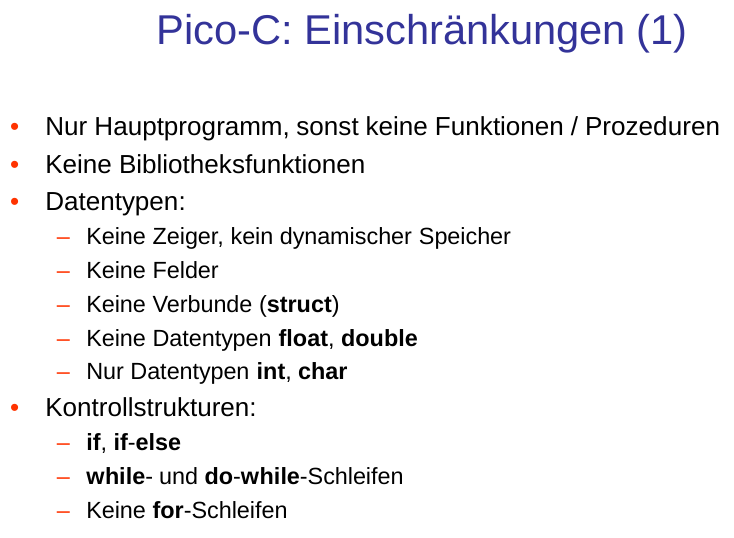

<!--small-->


---

## Funktionsumfang
### Syntax von PicoC in der Vorlesung
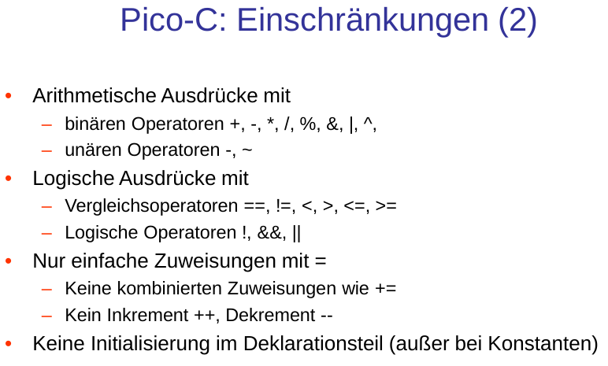

<!--small-->


---

## Funktionsumfang
### Zusätze / Änderungen
- **Kommentare**
- "**else if**": `if <single-statement> else if { <statement(s)> } else { <statement(s)> }`
- **Präzidenzregeln**
- zu **großes Literal** für `char` Datentyp (**Implicit Conversion**)
- zu **großes Literal** für Parameter
- **Fehlermeldungen** und **Warnings**
- **Shell** oder **Datei** angeben
- **Config-** bzw. **Dot-Files** um Einstellungen und Historie zu speichern
- **Farbige Ausgabe** von **Fehlermeldungen**, **RETI-Code**, **Symboltabelle**, **Abstraker Syntax**, **Token** usw.

<!-- keine Seperation von von **Deklarations-** und **Anweisungsteil** -->

<!--small-->


---

## Funktionsumfang
### Kommentare und else if
```c
void main() {
  const int var = 12;  // Einzeiliger Kommentar
  /* Mehrzeiliger Kommentar,
  der sich über mehrere Zeilen
  erstreckt */
  char var2;
  if (var > 100) {
    var2 = 2;
  } else if (/* Störender Kommentar */ var > 10)
    var2 = 1;
  else
    var2 = 0;
}
```

<!--small-->


---

<!-- ## Funktionsumfang -->
<!-- ### Deklarations- und Anweisungsteil -->
<!-- - **Deklaration** von **Variablen** und **Konstanten** an beliebiger Stelle möglich -->
<!--  -->
<!-- ```c -->
<!-- void main() { -->
<!--   int var = 0; -->
<!--   do { -->
<!--     var = var + 1; -->
<!--   } while (var < 10); -->
<!--   int var_2 = var; -->
<!-- } -->
<!-- ``` -->
<!--  -->
<!-- [> small <] -->
<!--  -->
<!--  -->
<!-- --- -->

## Funktionsumfang
### Präzidenzregeln
- **Konkrette Syntax:** `12 + 'c' - 1;`
  - **Astrakte Syntax:** `(12 + (99 - 1))`
- **Konkrette Syntax:** `12 * 'c' - 1;`
  - **Astrakte Syntax:** `((12 * 99) - 1)`
- **Konkrette Syntax:** `(12 < 1 + 2) * 2;`
  - **Astrakte Syntax:** `((12 < (1 + 2)) * 2)`
- **Konkrette Syntax:** `-(0 || !(12 < 3 || 3 >= 12));`
  - **Astrakte Syntax:** `(- (ToBool(0) || Not(((12 < 3) || (3 >= 12))))) `
- **Konkrette Syntax:** `12 < 1 + 2 && 12 || 0;`
  - **Astrakte Syntax:** `(((12 < (1 ^ 2)) && ToBool(12)) || ToBool(0))`

<!--small-->


---

## Funktionsumfang
### Zu großes Literal für `char`
- Wertebereich von `char` ist zwischen $-2^7$ und $2^7-1$
  ```c
  char var = 127;    // 2^7-1 ✅
  char var_2 = 128;  // 2^7   ❌
  ```
- **Implicit Conversion** von `int` zu `char`:
    ```
      00000000_00101011_10100110_01111111
    & 00000000_00000000_00000000_11111111  // 255
      00000000_00000000_00000000_01111111
    ```
  - mit **Bitmaske** abhängig vom **"Vorzeichenbit"** an der **8ten Stelle** nach der **8ten Stelle** mit $0$en oder $1$en überschreiben
    - **Fall 1:** 8te Stelle, Wert auf rechter Seite **positiv**
      - keine **Signextension** nötig

<!--small-->


---

## Funktionsumfang
### Zu großes Literal für `char`
- **Fall 2:** 8te Stelle, Wert auf rechter Seite **negativ**
  ```
    00000000_00000000_00000000_10000000  //  128
  v 11111111_11111111_11111111_00000000  // -256
    11111111_11111111_11111111_10000000  // -128
  ```
- Vergleich **PicoC-Compiler** und **Clang**:
  
  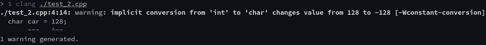

<!--small-->


---

## Funktionsumfang
### Zu großes Literal für Parameter
- semantischer Wert des **Literals** zwischen $-2^{21}$ und $2^{21}-1$
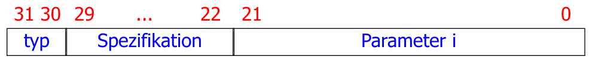
  ```c
  int var = 2097151;       // 2^21-1 ✅
  int var_2 = 2147483647;  // 2^31-1 ❌
  ```
- Wert des Literals durch **Shiften** erreichen:
  ```txt
    00000000_00000000_01111111_11111111  // 2^15-1
  * 00000000_00000001_00000000_00000000  // 2^16
    01111111_11111111_11111111_11111111  // 2^31-1
  ```
- aber sobald Wert des Literals $> 2^{31}-1$ **🠒** `TooLargeLiteralError`


<!--small-->


---

## Funktionsumfang
### Fehlermeldungen
- `MismatchedTokenError`
- `NoApplicableRuleError`
- `UnknownIdentifierError`
- `RedefinitionError`
- `ConstReassignmentError`
- `TooLargeLiteralError`
- `NoMainFunctionError`
- `MoreThanOneMainFunctionError`
- `InvalidCharacterError`
- `UnclosedCharacterError`
- `NotImplementedYetError`

<!--small-->


---

## Funktionsumfang
### Fehlermeldungen
#### MismatchedTokenError
#### 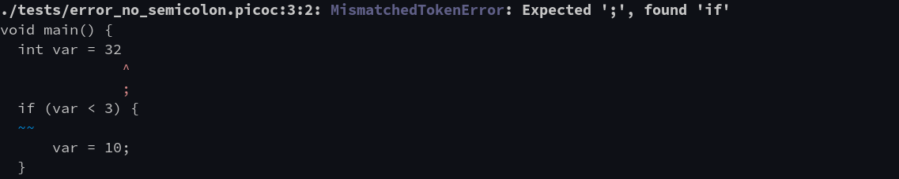
#### 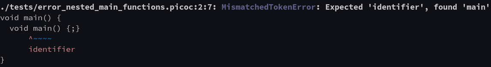

<!--small-->


---

## Funktionsumfang
### Fehlermeldungen
#### NoApplicableRuleError
#### 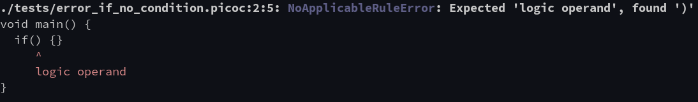
#### 

<!--small-->


---

## Funktionsumfang
### Fehlermeldungen
#### UnknownIdentifierError
#### 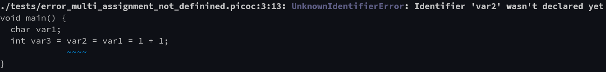
#### 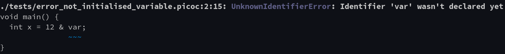

<!--small-->


---

## Funktionsumfang
### Fehlermeldungen
#### RedefinitionError
#### 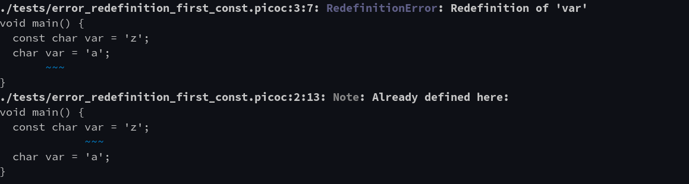

<!--small-->


---

## Funktionsumfang
### Fehlermeldungen
#### ConstReassignmentError
#### 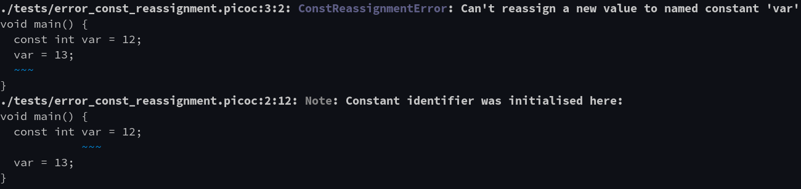

<!--small-->


---

## Funktionsumfang
### Fehlermeldungen
#### TooLargeLiteralError
#### 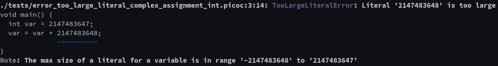
#### NoMainFunctionError
#### 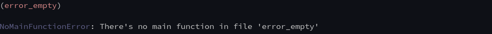

<!--small-->


---

## Funktionsumfang
### Fehlermeldungen
#### MoreThanOneMainFunctionError
#### 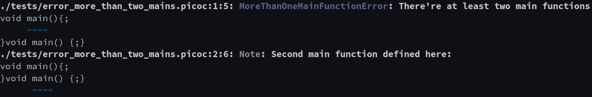

<!--small-->


---

## Funktionsumfang
### Fehlermeldungen
#### InvalidCharacterError
#### 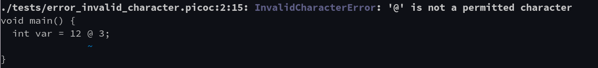
#### UnclosedCharacterError
#### 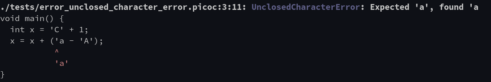

<!--small-->


---

## Funktionsumfang
### Warnungen
- `ImplicitConversionWarning`

<!--small-->


---

## Funktionsumfang
### Warnungen
#### ImplicitConversionWarning
#### 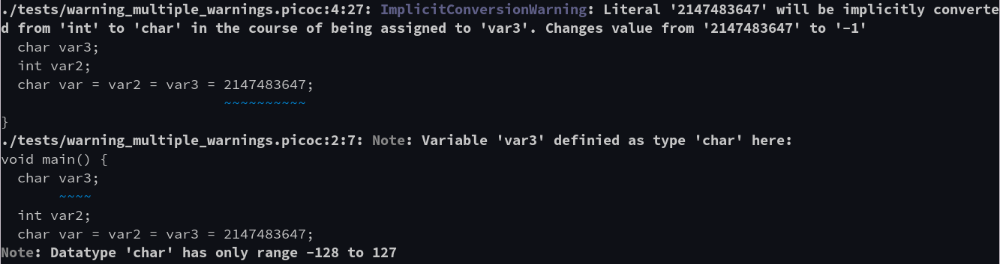

<!--small-->


---

## Funktionsumfang
### Warnungen
#### ImplicitConversionWarning
#### 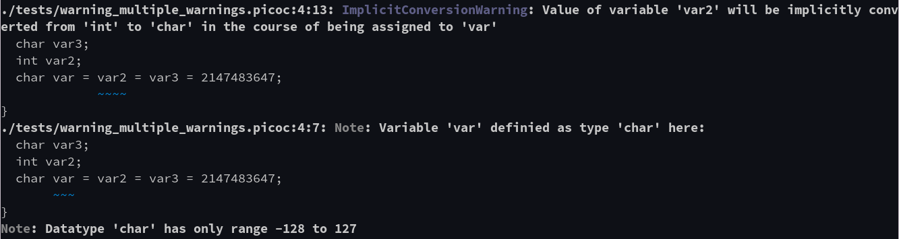

<!--small-->


---

## Funktionsumfang
### Datei direkt kompilieren
```bash
./pico_c_compiler -c -t -a -s -p -v -b 100 -e 200 -d 20 -S 2 -C ./code.picoc
```

### Shell
```bash
./pico_c_compiler
PicoC> compile -c -t -a -s -p -v -b 100 -e 200 -d 20 -S 2 "char bool_val = (12 < 1 + 2);";
PicoC> most_used "char bool_val = (12 < 1 + 2);";
```
- `compile <cli-options> "<code>";` (shortcut `cpl`, **multiline**)
- `most_used "<code>";` (shortcut `mu`, **multiline**)
- `color_toggle` (shortcut `ct`, **not** multiline), `-C` gets ignored
- `quit`: Shell verlassen

<!--small-->


---

## Funktionsumfang
### Shell
- `←`, `→`: **Cursor** links und rechs bewegen
- `↑`, `↓`: in der **Historie** vor- und rückwärts gehen
- **Multiline Command**: mit `↩` weitere Zeile, mit `;` terminieren
- `history`: ohne Argumente Liste aller ausgeführten Commands
  - `-r <command-nr>`: command mit Nr. `<command-nr>` **ausführen**
  - `-e <command-nr>`: command mit Nr. `<command-nr>` **editieren** mit `$EDITOR`
  - `-c <command-nr>`: Historie **leeren**
  - `ctrl+r` command mit substring **suchen**
- **Config Dateien** `settings.conf` und `history.json` in `~/.config/pico_c_compiler/`
  - `color_on: True` um gleich mit angeschalteten colors zu starten


<!--small-->


---

## Funktionsumfang
### Verwendung
- **Übersichtsseite:** https://github.com/matthejue/PicoC-Compiler
- **Help-page:** https://github.com/matthejue/PicoC-Compiler/blob/master/doc/help-page.txt
  - `pico_c_compiler -h`
  - in der **Shell**: `PicoC> help compile`

### 16-farbige  Ausgabe
- (so gut wie) alle Terminals unterstützen **16 Farben ANSI-Escapesequenzen**
- **Windows Cmd-Terminal** wird speziell gehandelt

<!--small-->


---

###### Architektur

<!--_class: lead-->
<!--big-->

<!-- _backgroundColor: #a8dec5; -->

---

## Architektur
### Klassendiagramm

- content

<!--small-->


---

## Architektur
### Sequenzdiagramm

- content

<!--small-->


---

## Architektur
### LL(1) Recursive-Descent Lexer

- content

<!--small-->


---

## Architektur
### LL(k) Recursive-Descent Parser

- Nicht-Terminalsymbole

<!--small-->


---

## Architektur
### Backtracking Parser

- content

<!--small-->


---

## Architektur
### Codegenerator

- content

<!--small-->


---

###### Vorführung

<!--_class: lead-->
<!--big-->

<!-- _backgroundColor: #a8dec5; -->

---

## Vorführung
### Kompilieren einer `.picoc` Datei

- content

<!--small-->


---

## Vorführung
### Vergleich von Fehlermeldungen in Clang / GCC und PCC

- content

<!--small-->


---

###### Bachelorabeit Themenvorschlag

<!--_class: lead-->
<!--big-->

<!-- _backgroundColor: #a8dec5; -->

---

###### Quellen

<!--_class: lead-->
<!--big-->

<!-- _backgroundColor: #a8dec5; -->

---

## Quellen
### Wissenquellen
- Parr, Terence. Language implementation patterns: create your own domain-specific and general programming languages. Pragmatic Bookshelf, 2009.
- IU-Fall-2021. “Course Webpage for Compilers (P423, P523, E313, and E513).” Accessed January 28, 2022. https://iucompilercourse.github.io/IU-Fall-2021/.

<!--small-->


---

## Quellen
### Bildquellen
- “Manjaro.” Accessed January 28, 2022. https://wallpapercave.com/w/wp9774690.

<!--small-->


---

## Quellen
### Quellen des Projekts
- alle verwendete(n) Patterns, Software, Packages usw.: https://github.com/matthejue/PicoC-Compiler/blob/master/doc/references.md

<!--small-->


---

###### Vielen Dank für eure Aufmerksamkeit!
###### :penguin:

<!--_class: lead-->
<!--big-->

<!-- _backgroundColor: #a8dec5; -->
