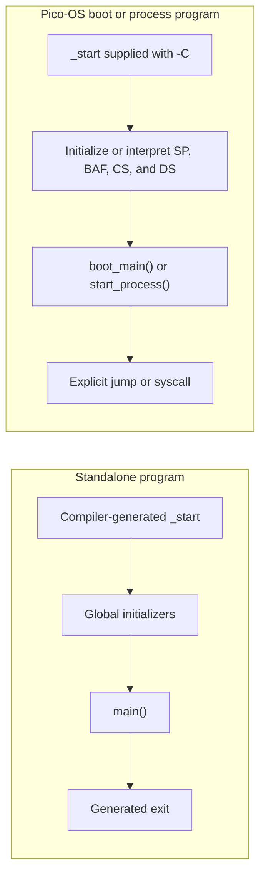
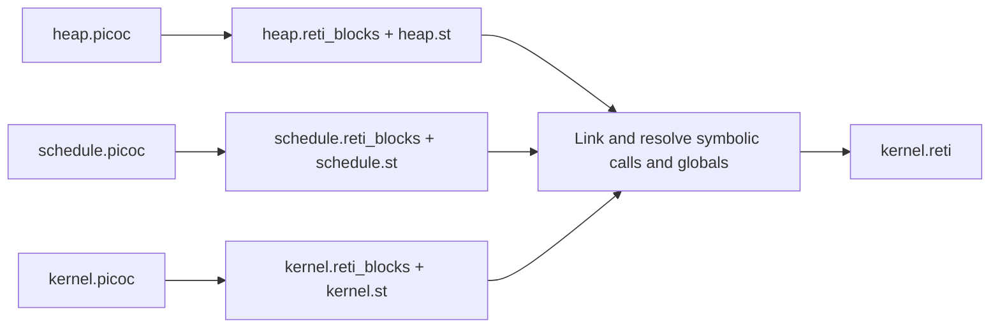
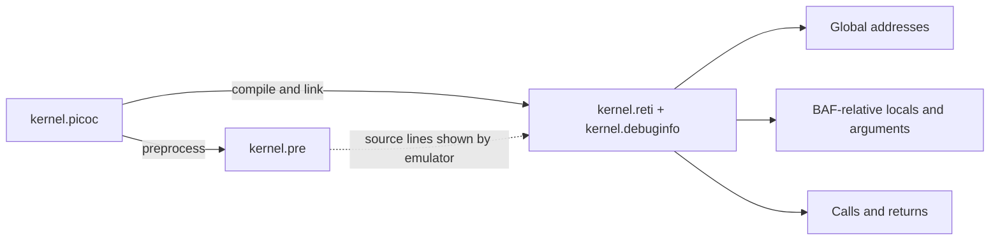
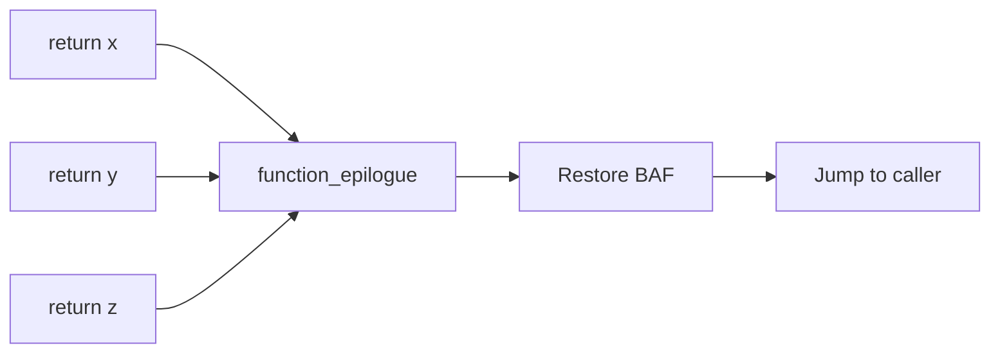
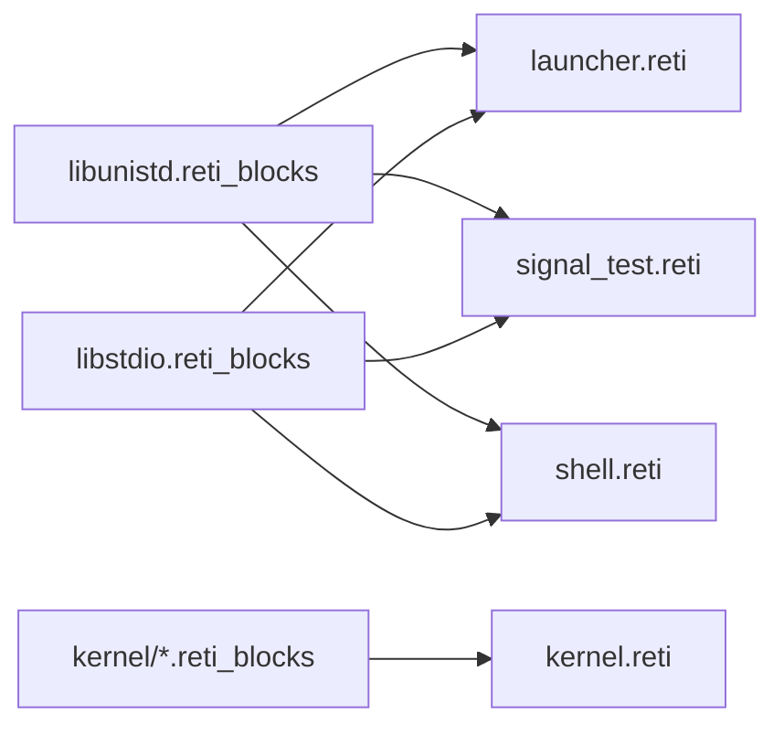

# New PicoC-Compiler Features Relevant to Pico-OS

This document lists user-visible compiler features added from commit
`c0c9f801ff139ca9ffc5ac5952c5c235ad80c75d` onward. The sections follow the
chronological order in which the features first appeared in the commit
history. Later commits that completed, corrected, or renamed the same feature
are listed with its original section.

Only behavior that still exists in the current compiler is described. For
example, the former general-purpose single-return function inliner is omitted;
the currently supported `static inline` assembly helper form is documented
instead. Historical names that no longer exist, such as `.json` symbol tables,
the `.interrupt_vector_table` section name, `break()` as a debug instruction,
and the built-in `print()`/`input()` functions, are also omitted in favor of
their current replacements.

The descriptions focus on what Pico-OS can rely on rather than only on the
compiler implementation. In particular, they call out consequences for the
kernel image, EPROM startup program, interrupt handlers, process startup,
system-call and libc wrappers, memory allocators, and the staged Make build.

## One-step local and global installation

`make full-install` creates the project virtual environment, installs the
Python dependencies, adjusts the compiler entry point to use that environment,
and installs the global `picoc_compiler` symlink. It combines the existing
dependency and global-install targets, so Pico-OS setup does not require those
steps to be invoked separately.

```sh
$ cd PicoC-Compiler
$ make full-install

$ cd ../Pico-OS
$ make
```

The Pico-OS `make` invocation can now find `picoc_compiler` through the
installed symlink.

Relevant commits: `c0c9f801ff13`, `3d2410ca4334`

## Generated `_start` and stack-framed `main`

When a linked program defines `main`, the compiler normally generates an
`_start` block. Global runtime initializers run first, `_start` calls `main`,
and the generated exit sequence runs after `main` returns. `main` is handled
like an ordinary function, so its parameters and local variables use its stack
frame instead of receiving special global-style storage.



Relevant commit: `a5ac630df502`

## Preprocessing, includes, and external syntax checking

PicoC source is preprocessed before parsing. The current preprocessor supports:

- quoted includes such as `#include "local.header"`
- angled includes such as `#include <stdio.header>`
- `#pragma once`
- object-like `#define` macros
- `-I PATH` include search paths and `-M DEPTH` include-depth control
- backslash-newline splicing
- correct recognition of directives around comments, strings, and character
  literals

Quoted includes search the including file's directory before configured
include paths. Angled includes search configured and system include paths.
Comments in a `#define` directive are removed without damaging quoted text.

The compiler also performs an external C syntax check unless `-s` /
`--supress_errors` is supplied. This catches malformed C-like input before the
PicoC passes run. The PicoC preprocessor remains intentionally smaller than a
complete C preprocessor: function-like macros and conditional directives such
as `#if` are not supported.

For example, a Pico-OS header can safely be reached through several include
paths:

```c
/* common/syscall.header */
#pragma once
#define SYSCALL_EXIT 9

/* kernel/process.header */
#include "../common/syscall.header"

/* kernel/syscall.header */
#include "../common/syscall.header"  /* skipped the second time */
```

Relevant commits: `de7c9cbf26f1`, `a25f677c5f6c`, `f6117f34c1d8`,
`241c8d6f30bd`, `789eebdc6ec1`, `dcff657b6277`

## Multi-file compilation and linking

Several compilation units can be supplied to one invocation. Each `.picoc`
file is compiled separately through RETI blocks and gets its own symbol table;
the linker then merges the RETI blocks and global symbol tables, assigns final
global addresses, and resolves references between files.

This makes ordinary Pico-OS separation possible: one source file may declare a
function or global that another source file defines. Global initialization
blocks from every unit are collected into the startup sequence, and symbol
resolution happens after the per-file results have been combined.



Relevant commits: `039d5a39a44b`, `70c9d6f982fa`, `a43999a9ddb0`,
`1ed6bf6d172c`, `f1ee6eacffd2`

## `debug;` source statement

PicoC accepts the custom statement `debug;`. It lowers to `INT 3`, allowing a
program to place an explicit emulator/debugger trap at a chosen source
location:

```c
int value = calculate();
debug;
use(value);
```

The earlier spelling used during development no longer exists; `debug;` is the
current syntax.

In Pico-OS development this is an explicit emulator trap, not a logging
statement. It is suitable for stopping at a kernel or library state while
debugging and should normally not remain on a production execution path.

Relevant commits: `f1ee6eacffd2`, `836458145ab1`

## Declarations mixed with statements

Local declarations are no longer restricted to a declaration-only prefix at
the beginning of a function. Variables may be declared where they are first
needed, including after executable statements and inside nested blocks:

```c
int result = first_step();
consume(result);
int later = second_step(result);
```

This lets Pico-OS code keep temporary variables next to the branch, allocation,
or device operation that uses them instead of moving every declaration to the
top of a long kernel function.

Relevant commit: `d4f00c763319`

## Object-like macros and `sizeof`

Object-like macros may be used as constants and aliases, including familiar
definitions such as `true`, `false`, and `NULL`. Expansion is recursive and
late enough for a macro to refer to another macro defined later. Cycles such as
`#define A B` and `#define B A` terminate safely instead of recursing forever.
Macro names inside string and character literals are left unchanged.

`sizeof` works with datatypes, variables, and expressions. It can therefore be
used in forms such as:

```c
sizeof(int)
sizeof(struct Header)
sizeof(header)
sizeof(pointer + 1)
```

```c
#define SYSCALL_SIGNAL 27
#define NULL ((void *)0)

struct SignalRequest request;
void *copy = kmalloc(sizeof(struct SignalRequest));
```

The source keeps the allocation tied to the request type instead of repeating
its word count.

Relevant commits: `7fb77d835e20`, `bd83cf2c4132`, `789eebdc6ec1`,
`dcff657b6277`

## Explicit casts and typed pointer arithmetic

Explicit casts are accepted throughout the compiler pipeline. This includes
integer/pointer conversions and casts used while navigating allocator metadata
or other low-level structures:

```c
#define NULL ((void *)0)

struct Header *header = get_header();
int *payload = (int *)(header + 1);
struct Header *next = (struct Header *)(payload + header->size);
```

PicoC's RETI values occupy machine cells, so a cast normally changes the type
used by later compiler decisions rather than emitting a separate conversion
instruction. That type still matters: pointer addition and subtraction are
scaled using the pointed-to datatype, and mixed array/pointer/struct access is
lowered through the correctly typed address calculation.

This behavior is essential in Pico-OS heap code, syscall request decoding,
process-context handling, and memory-mapped structures. Those paths frequently
convert integer addresses or `void *` storage into a concrete struct/pointer
type before doing scaled pointer arithmetic.

Relevant commits: `322252ed80e0`, `3fd899465cb5`, `b16d668b92f4`,
`da7d936217ea`, `60e304d5c90b`, `089e0e771627`, `2acb237178a2`,
`0a2cb1e7d541`

## Pointer return types and `void *`

Function declarations and definitions may return pointers, including forms
used by memory-management code:

```c
void *sbrk(int increment);
int *allocate_words(int count);
```

`void *` values can be declared, returned, passed, and explicitly converted to
typed pointers. A function declaration may also use `(void)` to express an
empty parameter list.

The Pico-OS allocator interface can now be written directly:

```c
void *kmalloc(int size) {
    return heap_alloc_from(&kernel_heap, size);
}

struct Process *process = (struct Process *)kmalloc(sizeof(struct Process));
```

Relevant commits: `40fe94c2b2cd`, `321285e387d5`, `946441129904`,
`17809b49336e`, `626786ebdbb4`

## Boolean conditions on dereferenced values and members

Values loaded through dereferences, array subscripts, and struct attributes can
be used directly as conditions. The compiler inserts the same boolean
normalization used for ordinary scalar expressions, so these forms now behave
as expected:

```c
if (*pointer) { /* ... */ }
if (array[index]) { /* ... */ }
if (process.ready) { /* ... */ }
```

Pico-OS uses these forms when walking pointer-linked kernel structures,
checking array-backed tables, and testing state flags stored in structs.

Relevant commit: `51cf5c9d5d18`

## Compile-time integer-expression simplification

Constant integer expressions are folded during compilation. This permits
computed sizes in places that require a constant, including global array
declarations and function parameter array declarations:

```c
#define ROWS 3
#define COLS 5

int cells[ROWS * COLS];
```

Arithmetic and other expressions made entirely from compile-time-known integer
values are reduced before later lowering passes, avoiding unnecessary runtime
instructions as well as satisfying array-size requirements.

For Pico-OS, this makes macro-computed static buffer/table sizes legal and
keeps address/size constants out of the generated runtime startup sequence.

Relevant commits: `e1636e8029e0`, `db25045dadde`

## Inline RETI assembly

PicoC may directly insert RETI assembly with `asm("...");`:

```c
asm("LOADI ACC 1");
asm("INT 0");
```

The argument must be one string literal, whose contents may contain one or more
RETI instructions. Those contents are parsed by the RETI grammar rather than
copied as opaque text.

A syscall wrapper shows the boundary clearly:

```c
int invoke_signal_syscall(int number, int argument) {
    int result;
    asm("LOADIN BAF ACC 3");  /* number */
    asm("LOADIN BAF IN1 4");  /* argument */
    asm("INT 0");
    asm("STOREIN BAF ACC 0"); /* result */
    return result;
}
```

Relevant commit: `dcc481631b31`

## String literals, stack strings, and unsized initialized arrays

String literals are represented by null-terminated global character arrays,
so a pointer may refer to a literal without allocating or constructing it at
the use site:

```c
char *message = "Hello";
```

Character arrays can also be initialized from a string. In a function this
creates the actual array in the function's stack frame rather than merely
storing a pointer:

```c
char message[6] = "Hello";
```

Unsized array declarations infer their outer size from an initializer. This is
what makes the idiomatic stack-string form possible:

```c
char message[] = "Hello";       /* inferred as char[6], including '\0' */
int values[] = {10, 20, 30};    /* inferred as int[3] */
```

An omitted size is accepted only when a valid string or array initializer
provides the size. String escape sequences are decoded before the array length
is calculated, so `char line[] = "a\n";` has room for `a`, one newline byte,
and the terminating null byte. Identical literals within a compilation unit
reuse one generated global, while literals from different compilation units
receive collision-free linker names.

This supports Pico-OS format strings, paths, command strings, and diagnostics
as global literal data, while local writable buffers can use stack arrays such
as `char buffer[] = "..."`. Cross-unit literal renaming matters because most
Pico-OS programs link several precompiled libraries that may each contain a
compiler-generated `__strlit_0`.

Relevant commits: `ac0d9edbcb61`, `e961329c661c`, `169749419bf2`,
`57a1af59a387`, `55f913710163`

## Variadic function syntax and argument layout

Declarations, definitions, and calls may use a trailing `...`. Pico-OS stdio
shows how the arguments are consumed without `va_list`:

```c
int format_argument(int baf, int index, int first_argument) {
    return *((int *)(baf + first_argument + index));
}

int printf(char *format, ...) {
    int argument_base;
    asm("MOVE BAF IN1");
    asm("STOREIN BAF IN1 0");
    return format_stream(stdout, format, argument_base, 4);
}
```

`printf(format, ...)` starts extras at `BAF + 4`; `fprintf(stream, format,
...)` starts at `BAF + 5`. Calls evaluate/push arguments right to left, and the
call's actual argument count determines its stack allocation. These offsets
are therefore part of the Pico-OS ABI.

Relevant commits: `987e8f0925b0`, `048a077f2153`

## System-V-style stack frames and call cleanup

The current call convention places local variables, the saved frame pointer
(`BAF`), the return address, and arguments in a consistent stack layout. The
called function saves and restores `BAF`, while the call site uses a generated
continuation-block label as its return address.

Arguments are evaluated and pushed from right to left. Their total size is
calculated from the actual call, and that argument space is released after the
callee returns. Multi-word arrays and structs advance through their complete
size; in particular, a struct passed by value uses its base word as its logical
address, so member access and forwarding read the correct stack slots. The
`PUSH`/`POP` lowering described later orders stack-pointer updates so an
interrupt between machine instructions cannot overwrite live values.

Pico-OS hand-written wrappers use this exact layout, listed from higher to
lower addresses:

| Address relative to `BAF` | Contents | Managed by |
| --- | --- | --- |
| `BAF + 4` | Second argument or first variadic argument | Caller |
| `BAF + 3` | First argument | Caller |
| `BAF + 2` | Return address | Caller |
| `BAF + 1` | Saved previous `BAF` | Callee |
| `BAF` | First local variable | Callee |
| `BAF - 1` | Later local variable | Callee |
| `SP` | Free cell below the occupied stack | Current stack boundary |

Thus `asm("LOADIN BAF ACC 3")` reads argument 1. Multi-word structs and arrays
occupy all of their cells in this same direction.

Relevant commits: `d4b9f3c34a04`, `c07095909a94`, `24b7843bd421`,
`a3d1cb62cd43`, `c5b576c93369`, `fa6d48a36358`

## Global struct forward declarations and repeat-safe headers

Structs may be forward-declared in global scope, allowing mutually referential
and opaque-pointer declarations:

```c
struct Process;

struct QueueEntry {
    struct Process *process;
};

struct Process {
    struct QueueEntry *entry;
};
```

Forward declarations inside a function remain unsupported and must be moved to
global scope. When several PicoC inputs include the same headers, compatible
repeated struct definitions, struct attributes, and function declarations are
accepted instead of being reported as duplicate global definitions. Repeated
includes also no longer create false duplicate-local-symbol errors.

The forward declaration is used in Pico-OS headers such as
`kernel/shared_memory.header` and `kernel/exception.header`, where APIs need a
`struct Process *` without including the complete process definition. This
breaks kernel header cycles while keeping the full struct private to the files
that require its layout.

Relevant commits: `266b4f026c34`, `d486899d52c2`, `893e836f42da`

## Top-of-file dependency metadata

The primary PicoC input may list additional build units in leading comments:

```c
// dependencies: lib/stdio/libstdio.reti_blocks drivers/uart.picoc
```

Blank lines, ordinary leading comments, and block comments may precede the
metadata. Paths may be absolute or resolved relative to the current working
directory or primary source directory. Current dependencies may be `.picoc`,
`.reti_blocks`, or matching `.st` artifacts; unsupported extensions are
rejected. `--direct-source-link` disables this automatic dependency discovery
when an invocation should use only its explicit inputs.

Pico-OS tests and subsystem sources use these comments to name precompiled
libraries such as `libstdio.reti_blocks`, `libunistd.reti_blocks`, and
`libschedule.reti_blocks`. This lets one source state its complete link inputs
without duplicating that dependency graph in a central Make rule.

Relevant commits: `ed3077fe8eae`, `75d4f6916e17`, `d06c14e74349`

## Postfix increment expressions

Postfix `++` works both as a statement and inside a larger expression. The
expression yields the old value and performs the increment exactly once:

```c
value++;
printf("%d", value++);
array[index++] = 3;
```

The last example writes through the original `index` and then increments
`index`, which was not possible with the initial statement-only
implementation.

In Pico-OS this is useful for buffer, argument-vector, descriptor, and table
traversal while preserving standard C postfix semantics.

Relevant commits: `77a1a313eafc`, `246bb2030971`

## Boolean negation of function results

A function call may be negated directly, including in a control-flow
condition. The returned value is converted to a boolean before `!` is applied:

```c
if (!device_ready()) {
    wait_for_interrupt();
}
```

This permits the usual Pico-OS error/availability pattern without introducing
a temporary solely to negate a function's return value.

Relevant commit: `ce065cafe3ea`

## RETI-block input and separate compilation artifacts

The compiler accepts `.reti_blocks` files as link inputs in addition to
`.picoc` sources. Each RETI-block artifact is paired with a `.st` symbol-table
file, allowing Pico-OS libraries and other units to be compiled once and linked
later. `-c` / `--compile` stops after producing the per-source `.reti_blocks`
and `.st` files; normal invocations can mix source and compiled units.

The RETI parser recognizes block labels, assembler directives, sections, and
the pseudoinstructions documented below. PicoC header files use the `.header`
extension, while `.reti_blocks` and `.reti_patch` distinguish structured
assembly from final flat `.reti` output.

```sh
$ picoc_compiler -c lib/stdio/libstdio.picoc
```

This writes `libstdio.reti_blocks` and `libstdio.st`. Link that artifact into
as many programs as needed:

```sh
$ picoc_compiler app.picoc lib/stdio/libstdio.reti_blocks -o app.reti
$ picoc_compiler test.picoc lib/stdio/libstdio.reti_blocks -o test.reti
```

Relevant commits: `8142f92b3a79`, `5523fb5fd422`, `1a34cb0d2ca9`,
`ec4747cbacf8`, `359e18b7418a`

## Generated debug information

`-g` / `--generate_debuginfo` writes `<output>.debuginfo`. It records source
ranges, global variables, function-local variables and arguments, call sites,
return addresses, and stack-frame information used by the RETI emulator.
Instruction addresses are relative to the RETI code segment and exclude IVT
and data entries.

Source locations refer to generated `.pre` files so line numbers match the
actual preprocessed program. Debug metadata survives separate compilation in
`.reti_blocks` files and is restored when those artifacts are linked. The
compiler warns when `-g` is used without `-i` and `-w`, because those options
are needed to create the corresponding `.pre` file for source debugging.



Relevant commits: `696b83b6ec61`, `09654fb7c7c5`, `9023deef7f1e`,
`64c3c016632d`, `291ed03da689`, `d27d5f062beb`, `75d4f6916e17`,
`c1e55bf0dcf1`

## Source-correlated intermediate output and metadata comments

With `-i -vv`, AST and intermediate output includes source file and line
information. Loop conditions inherit the correct source location, so emulator
source highlighting follows `while` and `do while` evaluation rather than an
unrelated statement. `-w` can write the preprocessed `.pre` source used for
that correlation.

Generated internal control-flow labels are prefixed with their owning function
name, for example `main_if.1` or `helper_while_branch.2`. With `-vv`, sections
whose numeric identifier is not already visible in their label show it in a
comment. The `-m` option also preserves nonnumeric top-of-file metadata comment
values in final RETI output, not just numeric test metadata.

```reti
# Generated from two different functions
handle_syscall_if.4:
schedule_while_branch.9:
schedule_while_after.10:
```

The prefix makes the owning Pico-OS subsystem visible without finding the
numeric block in a separate AST dump.

Relevant commits: `e375b5643be8`, `7d760df992b1`, `09654fb7c7c5`,
`39e58a4e7c78`, `1447b16fb0eb`, `5c5a630188b3`, `968321bb589e`,
`86ae6c94ff67`

## Function pointers and indirect calls

Function-pointer declarations, assignments, arrays, and calls are supported:

```c
int add(int left, int right);
int sub(int left, int right);

int (*operation)(int, int);
int (*operations[2])(int, int);

operation = add;
operations[0] = add;
operations[1] = sub;

int result = operation(3, 4);
int difference = operations[1](7, 4);
```

Indirect calls pass the calculated function address through the normal call
lowering and preserve debug call-site information. Parameter names are not
accepted inside the function-pointer type: use `int (*fp)(int, char)`, not
`int (*fp)(int x, char y)`.

The Pico-OS signal API is one concrete use:

```c
typedef void (*sighandler_t)(int);

int signal(int number, sighandler_t handler) {
    struct SignalRequest request;
    request.handler = (int)handler;
    request.restorer = (int)signal_restorer;
    return invoke_signal_syscall(SYSCALL_SIGNAL, (int)&request);
}
```

Relevant commits: `00b302d86702`, `3c038d7f7f09`, `1b033c1f356d`,
`a056a19da420`, `dd2f88477318`, `0a3e06fd81ef`

## RETI sections and `.sections` output

Linked output is organized into `.ivt`, `.text`, and `.data`. The linker keeps
section-relative code and data addresses distinct, resolves references across
sections, flattens the structured sections into final RETI output, and writes a
`.sections` metadata file describing the layout.

The original long IVT section name was later replaced everywhere by `.ivt`;
`.ivt` is the only current spelling. Ordinary code belongs to `.text`, ordinary
global storage belongs to `.data`, and section-aware linking preserves DS-
relative data addresses while assigning final code addresses.

| Start address | Region | Purpose |
| --- | --- | --- |
| `0` | `.ivt` | Vector cells read by hardware |
| `codesegment_start` | `.text` | `PC`/`CS`-relative instructions |
| `datasegment_start` | `.data` | `DS`-relative globals |
| `heap_start` | Free memory | First free cell after static data |

Relevant commits: `54a124eec419`, `4fba2c9d050f`, `235e6a23d550`,
`fa8076c8af13`, `6751a7a74667`

## Symbolic RETI operands and safe pseudoinstructions

Structured RETI and inline assembly may use symbols as operands. Final
resolution works for all supported instructions rather than only `LOADI` and
`JUMP`. Four useful pseudoinstructions are available:

- `LOADI32 reg operand` loads any 32-bit immediate or resolved symbol
- `JUMP32 rel target` reaches a target even when a normal jump offset is too
  large
- `PUSH reg` reserves a stack slot and stores the register
- `POP reg` loads a stack value and then releases its slot

`PUSH` moves `SP` before writing and `POP` reads before moving `SP`, preventing
an interrupt between the expanded instructions from overwriting a value that
is still needed. `LOADI32` and `JUMP32` are expanded only after final label
positions are known.

The stack operations expand in an interrupt-safe order:

| Pseudoinstruction | First concrete instruction | Second concrete instruction |
| --- | --- | --- |
| `PUSH ACC` | `SUBI SP 1` | `STOREIN SP ACC 1` |
| `POP ACC` | `LOADIN SP ACC 1` | `ADDI SP 1` |

Moving `SP` first on push and last on pop prevents a timer/UART interrupt from
overwriting the live cell. Pico-OS boot code also uses forms such as
`LOADI32 ACC start_loaded_kernel`; large kernel control-flow edges use
`JUMP32` when a normal RETI jump cannot reach.

Relevant commits: `5cc94ff77134`, `5ffc957334c5`, `52a0eca81611`

## Inspectable generated and combined startup RETI blocks

The compiler exposes the generated startup program as
`<output>_startprogram.reti_blocks` when intermediate files are written. With
`-i`, the fully linked RETI-block AST is printed under `Combined RETI Blocks`;
with both `-i` and `-w`, it is also written to
`<output>_combined.reti_blocks`. This makes the global-initializer and `_start`
sequence inspectable before final RETI flattening.

```sh
$ picoc_compiler -i -w -o kernel.reti ...
$ less kernel_startprogram.reti_blocks
$ less kernel_combined.reti_blocks
```

The first file shows startup generation; the second shows whether that block
and all global initializers appear before the rest of `.text`.

Relevant commit: `4a3da3a6acf6`

## Interrupt-vector entries in RETI blocks

The RETI grammar accepts both numeric and symbolic interrupt-vector entries:

```reti
.ivt
interrupt_vector_table:
  IVTE syscall_interrupt
  IVTE timer_interrupt
```

A numeric entry becomes `2^31 + i`. A label entry becomes `2^31` plus the
label's resolved block address relative to the appropriate code section. This
allows an IVT to name PicoC or RETI-block handlers without manually calculating
their final addresses.

The linker replaces each handler name with its final SRAM-tagged address; the
OS does not hard-code offsets.

Relevant commits: `1ed90e71251e`, `b2999b3b39b2`

## `-O1` compile-time global data generation

`-O0` remains the default and initializes globals through startup code. With
`-O1`, global initializers whose values are known at compile time are emitted
directly into ordered, symbol-named data blocks. Runtime-dependent global
initializers and every local initializer still execute at runtime.

This supports scalar, array, struct, string, and function-address data needed
by Pico-OS. Sectioned globals are emitted into their requested section; normal
globals go to `.data`. Declaration order is preserved so separately compiled
and later linked objects keep a stable global data layout.

The difference is visible in startup timing:

| Optimization | Compile-time-known globals | Runtime-dependent globals |
| --- | --- | --- |
| `-O0` | `_start` executes their stores | `_start` executes their stores |
| `-O1` | Words already exist in `.data` or `.ivt` when loaded | `_start` still executes their stores |

The Pico-OS vector table must take the second path because hardware can read it
before `_start` executes. Runtime-dependent initializers still remain in
`_start`.

Relevant commits: `5894fa6ff873`, `75d4f6916e17`

## `section("ivt")` declarations and definitions

PicoC supports the GNU-style attribute
`__attribute__((section("ivt")))` on global variables, function declarations,
and function definitions. For functions, the attribute on either the
declaration or definition is sufficient:

```c
__attribute__((section("ivt")))
void (*interrupt_vector_table[4])(void) = {
    syscall_interrupt,
    timer_interrupt,
    uart_interrupt,
    cpu_exception_interrupt
};
```

With `-O1`, the vector array is written into `.ivt` at compile time. References
to globals in `.ivt` use `CS` as their base, whereas ordinary `.data` globals
use `DS`. Other section names are rejected.

Compile this table with `-O1`; its four function addresses then occupy the
first four vector cells before any startup code runs. Interrupt hubs may also
be placed in `.ivt`, while normal handlers remain in `.text`.

Relevant commits: `45549f143174`, `235e6a23d550`, `97ff323809ab`

## Linking units without `main`

Libraries and other partial programs can be linked even when they do not
define `main`. If neither a selected startup source nor the linked inputs
provide `_start` or `main`, the compiler emits a warning and simply omits the
generated `_start` block. The output remains usable as a linkable or
loader-managed unit, although it is not directly executable through the
normal entry path.

```sh
$ picoc_compiler -c lib/signal/libsignal.picoc
```

This produces `libsignal.reti_blocks` and `libsignal.st` without inventing an
`_start` block.

Relevant commit: `bbd2b08b84e7`

## Direct `NOP` support in RETI blocks

`.reti_blocks` input may contain and emit `NOP` directly. It is represented as
a normal RETI AST instruction, so it survives parsing, transformation, block
layout, and final output without requiring an equivalent hand-written
instruction sequence.

```c
__attribute__((naked))
void illegal_instruction(void) {
    asm("MOVE PC IN1");
    asm("ADDI IN1 7");            /* address of the final NOP */
    asm("LOADI32 ACC 805306368"); /* invalid encoded opcode */
    asm("STOREIN IN1 ACC 0");
    asm("MOVE IN1 PC");
    asm("NOP");                   /* known instruction after the patch */
}
```

Relevant commit: `1944ef7bbb73`

## One shared epilogue per function

Every non-naked function gets one `<function>_epilogue` block. Each `return`
jumps to that shared block instead of duplicating the frame-restoration and
return sequence at every source return point. A non-void `return expression;`
places its result in `IN2`, allowing `JUMP32` to use `ACC` safely while the
caller retrieves the preserved result from `IN2`.



The result stays in `IN2`, leaving `ACC` available as the long-jump scratch
register.

The stable epilogue label can also be named from Pico-OS inline assembly.

Relevant commit: `f081e1abfda0`

## Naked PicoC functions

`__attribute__((naked))` is supported on function definitions. A naked
function receives no compiler-generated stack-frame prologue and no shared
epilogue. `return;` does not generate an epilogue jump; `return expression;`
only evaluates the expression and places its value in `IN2`.

The Pico-OS signal restorer is intentionally only the written instructions:

```c
__attribute__((naked))
void signal_restorer(void) {
    asm("LOADI IN1 0");
    asm("LOADI ACC 28"); /* SYSCALL_SIGRETURN */
    asm("INT 0");
}
```

There is no hidden prologue or epilogue around it. The EPROM `_start`, SRAM
kernel transition, and interrupt hubs use the same property to match
hardware-created frames exactly.

Relevant commit: `bbba12428143`

## Linked labels inside PicoC `asm`

Inline assembly is parsed into the same RETI AST used by `.reti_blocks` files.
Names inside instructions are therefore normal symbolic operands, not literal
text. A naked function can, for example, use
`asm("JUMP32 another_function");`, and the linker resolves the function label
after all compilation units and sections have been laid out.

```c
asm("LOADI32 ACC start_loaded_kernel");
asm("JUMP32 signal_epilogue");
```

Both names are resolved after final section layout; no numeric address or jump
distance has to be maintained in Pico-OS source.

Relevant commit: `75eafdffcbbd`

## Loader-oriented section metadata

For example, a current Pico-OS kernel produces this shape:

```json
{
  "interrupt_service_routines_start": 4,
  "codesegment_start": 4,
  "datasegment_start": 32705,
  "heap_start": 33189,
  "heap_size": -1,
  "stack_start": 40000
}
```

`heap_start` points immediately after all allocated data-segment global
storage, including globals that use runtime initialization under `-O0`.
`heap_size` and `stack_start` default to `-1`, allowing the loader to substitute
its configured defaults. `interrupt_service_routines_start` is emitted when a
leading numeric IVT is followed by handler code, giving the loader the start of
that code.

| Memory area | Boundary or direction |
| --- | --- |
| Static data | Ends at `heap_start - 1` |
| Kernel heap | `heap_start` through `heap_start + heap_size - 1` |
| Kernel stack | Grows downward from `stack_start` |
| Process memory | Begins at `stack_start + 1` |

`-1` tells the loader/header generator to substitute its configured default.
The code/data starts drive `CS`/`DS` relocation when EPROM copies the kernel to
SRAM.

Relevant commits: `8bddbd145e31`, `79acb65b6bdb`, `4cbaf5fd2074`,
`574593b3da15`

## Kernel memory-header generation

`-k sram` and `-k eprom` run linking far enough to compute final section
addresses, then write only `memory_constants.header`. In this mode `-o`
chooses the directory/path used for that header rather than a `.reti` output
name.

SRAM mode generates absolute memory-map constants such as `SRAM_BASE`,
`SRAM_MAX_ADDRESS_IN_MEMORY_MAP`, `KERNEL_HEAP_START`, `KERNEL_HEAP_SIZE`, and
`PROCESS_MEMORY_START`, plus `LOADI32` strings for initializing `CS`, `DS`,
`SP`, and `ACC`. `KERNEL_HEAP_SIZE` uses `4096` when `.sections` leaves
`heap_size` at `-1`. EPROM mode generates the SRAM maximum and assembly strings
for the EPROM data-segment and SRAM-top stack setup.

An SRAM header generated for the kernel looks like:

```c
#define KERNEL_HEAP_START -2147450459
#define KERNEL_HEAP_SIZE 4096
#define PROCESS_MEMORY_START -2147443647
#define KERNEL_CS_START_ASM "LOADI32 CS -2147483644"
#define KERNEL_DS_START_ASM "LOADI32 DS -2147450943"
#define KERNEL_SP_START_ASM "LOADI32 SP -2147443648"
```

The allocator consumes it without repeating layout arithmetic:

```c
void init_kernel_heap(void) {
    heap_init_region(
        &kernel_heap,
        (void *)KERNEL_HEAP_START,
        KERNEL_HEAP_SIZE
    );
}
```

The addresses in SRAM mode are absolute tagged RETI memory-map addresses, not
plain section offsets.

Relevant commits: `359e18b7418a`, `3d88a952ab2a`, `4bcefa1d7826`,
`f6c7ade2c903`, `b4b3c03900fe`, `4c198977b2ac`, `87c7522fe015`

## `static inline` assembly helpers

The currently supported inlining form is a no-argument `static inline`
function whose body consists only of `asm("...");` statements:

```c
static inline void save_acc(void) {
    asm("PUSH ACC");
}
```

A statement-form call such as `save_acc();` is replaced with a copy of those
assembly statements, and no standalone `save_acc` function is emitted. Helpers
with parameters or arguments are rejected. Ordinary C function bodies are not
currently inlined merely because they carry the `inline` keyword.

For Pico-OS, this form is appropriate for small repeated register-save,
register-restore, or device-access sequences inside naked handlers. It avoids a
normal call frame at places where the exact interrupt stack image must remain
under OS control.

Relevant commit: `4bcefa1d7826`

## Custom startup sources with `-C`

`-C PATH` / `--startup-source PATH` links an additional `.picoc` or compiled
`.reti_blocks` startup unit. If it defines `_start`, that block replaces the
generated default and is placed first in `.text`; otherwise, the compiler still
generates the normal `_start` that calls `main`.

Global initializer blocks are prepended to either startup form. While `-C` is
active, the compiler's `Exit()` lowering uses syscall 9 via `INT 4` instead of
the normal `JUMP 0` termination sequence. Accepting a compiled startup artifact
allows fully staged Pico-OS builds without recompiling startup source at final
link time.

The EPROM startup begins with the generated constants and no compiler frame:

```c
__attribute__((naked))
void _start(void) {
    asm(EPROM_STACK_START_ASM);
    asm("MOVE SP BAF");
    asm(EPROM_DS_START_ASM);
    asm("ADD DS CS");
    asm("LOADI32 ACC boot_main");
    asm("ADD ACC CS");
    asm("MOVE ACC PC");
}
```

Userspace `libstart` is the other form: it interprets the kernel-created
`argc`/`argv` frame, initializes the process heap, calls `main`, and exits via
syscall 9.

Relevant commits: `f4215ee17763`, `e57eb17568b2`, `75d4f6916e17`

## Scoped `typedef` names

PicoC supports `typedef` declarations and resolves the aliases according to
scope. Aliases may be used for function return and parameter types, local
variables, pointers, arrays, and struct fields:

```c
typedef int pid_t;
typedef char byte_t;

struct QueueEntry {
    pid_t owner;
    byte_t payload[16];
};
```

An inner typedef may shadow an outer name for its scope without changing the
meaning of uses outside that scope.

Pico-OS uses aliases for public ABI types and function pointers; a concrete
example is `typedef void (*sighandler_t)(int)` in the signal library. Scoped
resolution allows common type names in headers without turning every alias
into a compiler-global special case.

Relevant commit: `67948ed50f92`

## Complete standard character escapes

Character literals and strings decode the supported standard escapes to their
numeric byte values. In addition to the null, newline, carriage return, tab,
quote, and backslash forms, PicoC now handles `\a`, `\b`, `\f`, `\v`, and
`\?`. String-array sizing uses the decoded characters rather than the number
of source-code characters.

```c
char line[] = "panic:\tstack overflow\n";
/* decoded bytes: panic: <TAB> stack overflow <LF> <NUL> */
```

Array sizing counts the decoded tab/newline once each, not the two source
characters used to spell each escape.

Relevant commit: `48fe930bd632`

## Reliable staged linking of compiled units

Staged builds can compile sources and dependencies independently, then link
only `.reti_blocks`/`.st` pairs. Compiled artifacts retain source/debug
metadata, data blocks are not mistaken for code blocks, global symbol order is
preserved, and DS-relative data references remain correct when final code
addresses are assigned. `-C` also accepts a staged startup artifact.

These details make separately compiled Pico-OS libraries and the kernel behave
the same as a direct all-source link, including cross-section calls and global
data access.



Preserved DS-relative data and declaration order make these staged links match
an equivalent direct source link.

Relevant commits: `517b1098743e`, `6751a7a74667`, `75d4f6916e17`

## Automatic reuse of unchanged compilation artifacts

Compiled `.reti_blocks` files record their original source, included files,
content hashes, and relevant compiler settings. When a `.picoc` input and all
of those inputs still match, the compiler reuses the existing `.reti_blocks`
and `.st` pair. Changed, missing, or differently configured inputs cause a
normal recompilation.

`-i` and `-w` deliberately bypass reuse so the requested intermediate stages
can be regenerated. `--direct-source-link` also bypasses cached artifacts and
dependency metadata. Reused artifacts retain debug information.

```reti
# @picoc-cache {"source":".../stdio.picoc",
#   "inputs":["stdio.picoc", "stdio.header", "syscall.header"],
#   "options":{"optimization_level":1, "generate_debuginfo":false}}
```

| Cache comparison | Result |
| --- | --- |
| Input hashes and relevant options are unchanged | Reuse `.reti_blocks` and `.st` |
| Source, header, ABI, `-O`, or `-g` input changed | Compile again |

Relevant commit: `d06c14e74349`

## Build-input reporting and Make dependency files

`--show-input-files` prints the `.picoc` inputs or `.reti_blocks`/`.st` pairs
selected for a build, which is useful for checking whether a Pico-OS build is
using source or staged artifacts.

With `-c` and exactly one `.picoc` input, `--dependency-file PATH` writes a Make
dependency file for the generated RETI-block target and every included source
or header. This lets Make rebuild an artifact when any preprocessor input
changes without recompiling unrelated units.

```sh
$ picoc_compiler -c lib/stdio/stdio.picoc --dependency-file build/stdio.d

$ picoc_compiler --show-input-files app.picoc libstdio.reti_blocks
```

Example output:

```text
[input] Using .picoc file: 'app.picoc'
[input] Using .reti_blocks/.st pair: 'libstdio.reti_blocks', 'libstdio.st'
```

Pico-OS defines `PICOC_BUILD := picoc_compiler --show-input-files`, making the
selected source/artifact path visible in normal Make output.

Relevant commit: `a2eb98155759`
